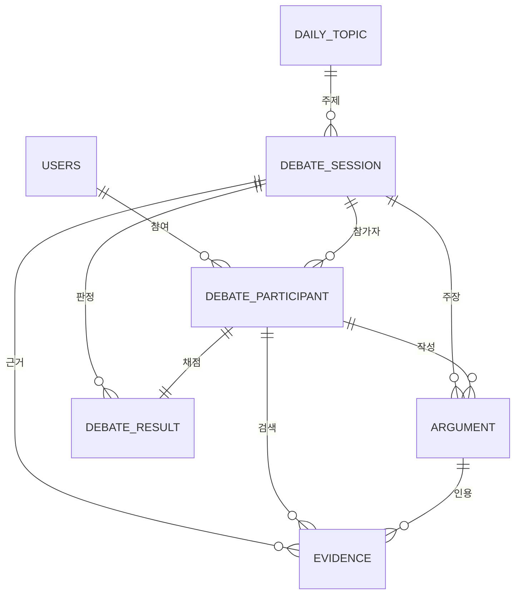

# 야차철학 — ERD & API 명세서 (Final v2)

> Base URL: `https://api.{도메인}/api/v1`
> 인증: ✅ 필수 / 선택 / — 불필요
> MVP 런칭: 10/31

---

# PART 1. ERD

## 1-1. 전체 관계도



---

## 1-2. MVP 테이블 (7개)

### users — 사용자

| 컬럼 | 타입 | 제약 | 비고 |
| --- | --- | --- | --- |
| id | BIGINT | PK |  |
| email | VARCHAR(255) | UNIQUE, NULL | 게스트는 NULL |
| password | VARCHAR(255) | NULL | 게스트는 NULL |
| nickname | VARCHAR(50) | NN |  |
| is_guest | BOOLEAN | NN |  |
| role | VARCHAR(20) | NN | `USER` / `ADMIN` |
| created_at | DATETIME | NN |  |
| updated_at | DATETIME | NN |  |

> 게스트도 `users` 행을 만든다. 회원 전환 시 같은 행에서 `is_guest = false` → 데이터 이관 불필요.

### daily_topic — 오늘의 야차판 주제

| 컬럼 | 타입 | 제약 | 비고 |
| --- | --- | --- | --- |
| id | BIGINT | PK |  |
| topic_date | DATE | UNIQUE | 하루 한 주제 |
| category | VARCHAR(20) | NN | `ETHICS` / `LOVE` / `SCIENCE` / `SOCIETY` |
| question | TEXT | NN |  |
| option_a | VARCHAR(255) | NN |  |
| option_b | VARCHAR(255) | NN |  |
| created_at | DATETIME | NN |  |

### debate_session — 토론 세션

| 컬럼 | 타입 | 제약 | 비고 |
| --- | --- | --- | --- |
| id | BIGINT | PK |  |
| topic_id | BIGINT | FK, NN | → daily_topic |
| mode | VARCHAR(20) | NN | `AI` / `HUMAN` (MVP는 AI만) |
| evidence_mode | VARCHAR(20) | NN | `NONE`(키배 ONLY) / `ENABLED`(근거 무기) |
| status | VARCHAR(20) | NN | `WAITING` / `IN_PROGRESS` / `FINISHED` |
| is_public | BOOLEAN | NN | 공개 페이지 노출 여부 |
| origin_session_id | BIGINT | FK, NULL | 도전장용 — 컬럼만 확보 |
| created_at | DATETIME | NN |  |
| ended_at | DATETIME | NULL |  |

### debate_participant — 참가자

| 컬럼 | 타입 | 제약 | 비고 |
| --- | --- | --- | --- |
| id | BIGINT | PK |  |
| session_id | BIGINT | FK, NN |  |
| user_id | BIGINT | FK, NULL | AI는 NULL |
| participant_type | VARCHAR(20) | NN | `USER` / `AI` |
| role | VARCHAR(20) | NN | `INITIATOR` / `OPPONENT` |
| selected_option | VARCHAR(1) | NN | `A` / `B` |
| joined_at | DATETIME | NN |  |

### argument — 주장

| 컬럼 | 타입 | 제약 | 비고 |
| --- | --- | --- | --- |
| id | BIGINT | PK |  |
| session_id | BIGINT | FK, NN |  |
| participant_id | BIGINT | FK, NN |  |
| argument_type | VARCHAR(20) | NN | `ARGUMENT` / `REBUTTAL` / `FINAL` |
| turn_no | INT | NN | 서버 채번 |
| content | TEXT | NN |  |
| created_at | DATETIME | NN |  |

> 진행 순서: `INITIATOR: ARGUMENT → OPPONENT: REBUTTAL → INITIATOR: FINAL → 종료`

### evidence — LINER 근거 검색 결과

| 컬럼 | 타입 | 제약 | 비고 |
| --- | --- | --- | --- |
| id | BIGINT | PK |  |
| session_id | BIGINT | FK, NN |  |
| participant_id | BIGINT | FK, NN |  |
| used_argument_id | BIGINT | FK, NULL | **실제로 인용한 주장** |
| query_text | VARCHAR(500) | NN |  |
| title | VARCHAR(500) | NN |  |
| url | VARCHAR(1000) | NN |  |
| snippet | TEXT |  |  |
| source_type | VARCHAR(30) | NN | `WEB` / `SCHOLAR` |
| created_at | DATETIME | NN |  |

> 검색 결과 1건당 1행. `used_argument_id` 로 **검색 대비 인용률**을 지표로 뽑는다.

### debate_result — 판정 + 철학자 판독

| 컬럼 | 타입 | 제약 | 비고 |
| --- | --- | --- | --- |
| id | BIGINT | PK |  |
| session_id | BIGINT | FK, NN |  |
| participant_id | BIGINT | FK, NN |  |
| clarity_score | INT | NN | 0~20 |
| logic_score | INT | NN | 0~20 |
| evidence_score | INT | NN | 0~20 |
| rebuttal_score | INT | NN | 0~20 |
| consistency_score | INT | NN | 0~20 |
| total_score | INT | NN | 0~100 |
| result | VARCHAR(10) | NN | `WIN` / `LOSE` / `DRAW` |
| philosopher_name | VARCHAR(100) | NN |  |
| philosopher_percentage | INT | NN |  |
| philosopher_reason | TEXT |  |  |
| matched_sentence | TEXT |  | **사용자가 실제로 쓴 문장** |
| created_at | DATETIME | NN |  |

> 🔴 `UNIQUE(session_id, participant_id)` — 나중에 PVP에서 양쪽을 채점하면 세션당 2행이 된다.

---

## 1-3. 주요 인덱스

| 테이블 | 인덱스 |
| --- | --- |
| daily_topic | `(topic_date)`, `(category, topic_date)` |
| debate_session | `(topic_id, created_at)`, `(is_public, status, ended_at)` |
| debate_participant | `(user_id)`, `(session_id)` |
| argument | `(session_id, turn_no)` |
| evidence | `(session_id, participant_id)`, `(used_argument_id)` |

---

## 1-4. ERD 수정 필요 (지금)

| 대상 | 변경 |
| --- | --- |
| `argument` | `crentent` → `content` 오타 수정 |
| `debate_result` | `session_id` UNIQUE → `UNIQUE(session_id, participant_id)` |
| `debate_session` | `is_public`, `evidence_mode` 추가 |
| `daily_topic` | `category` 추가 |
| `users` | `role`, `password` 추가 |

---

# PART 2. API 명세 (MVP)

## 2-1. 인증 · 사용자

**두 가지 인증 방식을 모두 구현한다.**

| 방식 | 대상 | 저장 |
| --- | --- | --- |
| 세션 (쿠키) | 웹 클라이언트 | Redis (Spring Session) |
| 토큰 (JWT) | 게스트 · 모바일 | 무상태 |

| Method | Path | 설명 | 인증 |
| --- | --- | --- | --- |
| POST | `/auth/signup` | 회원가입 | — |
| POST | `/auth/login` | 로그인 (세션 발급) | — |
| POST | `/auth/logout` | 로그아웃 (세션 만료) | ✅ |
| POST | `/auth/token` | 로그인 (JWT 발급) | — |
| POST | `/auth/token/refresh` | 토큰 재발급 | — |
| POST | `/auth/guest` | 게스트 생성 + JWT 발급 | — |
| POST | `/auth/upgrade` | 게스트 → 회원 승격 | ✅ |
| GET | `/users/me` | 내 정보 · 누적 통계 | ✅ |
| PATCH | `/users/me` | 닉네임 변경 | ✅ |

**로그인 정책 (MVP)**

| 기능 | 게스트 | 회원 |
| --- | --- | --- |
| 봇전 (AI 토론) | ✅ | ✅ |
| 공개 페이지 열람 | ✅ | ✅ |
| 전투 기록 조회 | ❌ | ✅ |

**결정 필요**

- [ ] 세션과 JWT 중 무엇을 기본으로 할지, 어느 클라이언트가 어느 쪽을 쓸지
- [ ] 두 방식이 섞일 때 `SecurityContext` 를 어떻게 통일할지

---

## 2-2. 주제 · 카테고리

| Method | Path | 설명 | 인증 |
| --- | --- | --- | --- |
| GET | `/topics/today` | 오늘의 야차판 + A/B 선택 현황 | — |
| GET | `/topics` | 주제 목록 (카테고리 · 페이징) | — |
| GET | `/topics/{id}` | 주제 상세 | — |
| GET | `/categories` | 카테고리 목록 | — |

---

## 2-3. 토론 세션

| Method | Path | 설명 | 인증 |
| --- | --- | --- | --- |
| POST | `/sessions` | 토론 시작 (봇전) | 선택 |
| GET | `/sessions/{id}` | 세션 상세 | 선택 |
| POST | `/sessions/{id}/finish` | 종료 → 판정 요청 | 선택 |
| GET | `/sessions/me` | 전투 기록 | ✅ |

**세션 생성 옵션**

```json
{ "topicId": 101, "selectedOption": "A", "mode": "AI", "evidenceMode": "ENABLED" }
```

> 세션 생성 시 사용자 참가자와 AI 참가자를 **한 트랜잭션에서 함께 만든다.**
> AI의 `selected_option` 은 사용자의 반대편으로 자동 지정.

---

## 2-4. 주장

| Method | Path | 설명 | 인증 |
| --- | --- | --- | --- |
| POST | `/sessions/{id}/arguments` | 주장 제출 | 선택 |
| GET | `/sessions/{id}/arguments` | 주장 목록 · AI 응답 폴링 | 선택 |

**서버 검증**

- 요청자가 이 세션의 참가자인가
- `argument_type` 이 현재 순서에 맞는가
- `turn_no` 는 **서버가 채번** (클라이언트 값 신뢰 금지)
- 인용한 근거가 있으면 `evidence.used_argument_id` 업데이트

> 턴 제한 시간이 있으면 응답에 `turnDeadline` 포함. **마감 시각의 기준은 서버.**

---

## 2-5. LINER 근거 무기

| Method | Path | 설명 | 인증 |
| --- | --- | --- | --- |
| POST | `/sessions/{id}/evidence` | 근거 검색 실행 | 선택 |
| GET | `/sessions/{id}/evidence` | 세션의 근거 전체 | 선택 |
| POST | `/sessions/{id}/evidence/compose` | 선택한 근거로 문장 자동 작성 | 선택 |

**구현 메모**

- `compose` 는 검색과 **별개의 LLM 호출**이다 (“근거 선택하면 텍스트창에 알아서 글이 써짐”)
- 대결당 API 호출이 한 번 더 늘어나므로 원가 계산에 반영
- **API 키는 서버에서만 사용. 프론트 노출 금지**
- 세션당 검색 횟수 제한 (제안: 2회)
- 동일 쿼리 캐싱 권장

---

## 2-6. 판정 결과

| Method | Path | 설명 | 인증 |
| --- | --- | --- | --- |
| GET | `/sessions/{id}/result` | AI 판정 점수 + 철학자 판독 | 선택 |

**생성 규칙**

- 각 항목 20점 만점, `total_score` = 5개 합 (0~100)
- `result` 는 총점 구간으로 판정 (제안: 80↑ WIN / 60~79 DRAW / 60↓ LOSE) — **구간 합의 필요**
- `matched_sentence` 는 **사용자가 실제로 쓴 문장**을 그대로 넣는다. LLM이 지어내지 않도록 프롬프트에서 원문 문장만 고르도록 제약할 것
- 생성 중이면 `{ "status": "PENDING" }` 반환

---

## 2-7. 공개 페이지

| Method | Path | 설명 | 인증 |
| --- | --- | --- | --- |
| GET | `/public/sessions` | 종료된 토론 목록 | — |
| GET | `/public/sessions/{id}` | 공개 토론 상세 | — |

> 🔴 애드센스 심사와 검색 유입의 핵심.
> 로그인 없이 전체 내용이 보여야 하고, **SSR 또는 메타태그 처리가 필요**하다. 프론트와 합의할 것.

---

## 2-8. 관리자

| Method | Path | 설명 | 인증 |
| --- | --- | --- | --- |
| PATCH | `/admin/sessions/{id}/visibility` | 세션 공개 여부 변경 | ADMIN |

> 신고 기능 전체는 2차지만, **문제 있는 내용을 공개 페이지에서 내리는 수단**은 운영 기간에 반드시 필요하다.

---

## 2-9. 공통 규약

**응답 래퍼**

```json
{ "success": true, "data": { }, "error": null }
```

```json
{ "success": false, "data": null,
  "error": { "code": "SESSION_NOT_FOUND", "message": "토론을 찾을 수 없습니다" } }
```

**비동기**: LLM 호출은 `202 Accepted` 반환 후 폴링 (제안 간격 1.5초, 30초 타임아웃)

**에러 코드**

| 코드 | HTTP | 상황 |
| --- | --- | --- |
| `TOPIC_NOT_FOUND` | 404 | 해당 날짜 주제 없음 |
| `SESSION_NOT_FOUND` | 404 |  |
| `NOT_PARTICIPANT` | 403 | 내 세션이 아님 |
| `INVALID_TURN` | 409 | 순서에 맞지 않는 argument_type |
| `SESSION_FINISHED` | 409 | 이미 종료됨 |
| `EVIDENCE_LIMIT_EXCEEDED` | 429 | 근거 검색 제한 초과 |

---

## 2-10. 전체 호출 흐름

```
GET  /topics/today
POST /auth/guest                          (비회원)
POST /sessions                            { topicId, selectedOption, mode: "AI", evidenceMode }
POST /sessions/{id}/arguments             { argumentType: "ARGUMENT", content }
GET  /sessions/{id}/arguments?afterTurn=1 (폴링 → AI REBUTTAL)
POST /sessions/{id}/evidence              { query }
POST /sessions/{id}/evidence/compose      { evidenceIds }
POST /sessions/{id}/arguments             { argumentType: "FINAL", content }
POST /sessions/{id}/finish
GET  /sessions/{id}/result                (폴링)
```

---

# PART 3. 2차 (런칭 후)

| 기능 | 내용 | 필요 테이블 |
| --- | --- | --- |
| **도전장 공유** | 링크로 친구에게 반박 요청 | `challenge_link` |
| **PVP 실시간 토론** | 매칭, WebSocket, 이탈 처리 | — (`mode`, `status` 활용) |
| **실시간 관전 · 투표** | 참가자와 같은 채널 구독, 발행 권한만 분리 | `vote` |
| **알림** | 07~09시 · 17~19시 푸시 | `push_subscription`, `notification_setting`, `notification` |
| **밸런스 게임** | 카드 선택 → MBTI 철학 결과 | `balance_card`, `balance_result` |
| **1분 철학** | 기본(매일) · 시사(주 1회) | `daily_philosophy` |
| **신고 · 차단** | 주장 신고, 사용자 차단 | `report`, `user_block` |

> 🔴 **실시간 토론과 신고 기능은 세트로 연다.** 실시간만 먼저 열지 않는다.

---

# PART 4. 역할 분담 (백엔드 3명)

|  | 담당 | 주요 작업 |
| --- | --- | --- |
| **A** | 인증 · 토론 코어 | 세션/JWT 인증, 게스트, 토론 세션, 주장 |
| **B** | 콘텐츠 · 공개 영역 | 주제·카테고리, 공개 페이지, 관리자, 지표 집계 |
| **C** | 인프라 · 외부 연동 | 배포/CI-CD, LINER 연동, AI 반박, 판정 생성 |

### 배치 근거

**A — 인증은 다른 모든 API의 전제**라 가장 먼저 끝나야 한다. 세션·주장도 초반에 만들어야 하는 코어라 같은 구간에 묶었다. A는 10/12~10/23 시험 기간이 있어 **앞쪽에 몰린 작업**을 맡는 것이 맞다.

**B — 공개 페이지가 MVP의 숨은 핵심.** 애드센스 심사와 검색 유입이 여기 걸려 있다. 주제 관리와 지표 집계도 함께 맡고, 여유가 생기면 2차 실시간 설계를 미리 시작한다.

**C — 배포는 초반에 몰리고 중반에 비는 작업**이라 외부 연동 전반을 함께 맡는다. LINER 호출이 검색·compose·AI 반박·판정까지 네 군데라 한 사람이 모아서 보는 편이 비동기 큐와 API 비용 관리에 유리하다.

---

## 주차별 일정

| 주차 | A | B | C |
| --- | --- | --- | --- |
| 9/21~9/27 | 인증(세션+JWT)·게스트 | 주제·카테고리 API | **배포 파이프라인 + 도메인** |
| 9/28~10/4 | 세션 생성·참가자 | 공개 페이지 | LINER 검색 연동 |
| 10/5~10/11 | 주장·턴 검증 | 관리자 도구·지표 쿼리 | AI 반박·판정 |
| 10/12~10/18 | ⚠️ 시험 | 공개 페이지 SSR 대응 | compose API·안정화 |
| 10/19~10/23 | ⚠️ 시험 | 2차 실시간 설계 | 운영 점검·모니터링 |
| 10/24~10/30 | 복귀·통합 | 통합 테스트 | 런칭 준비 |
| **10/31** | **런칭** |  |  |
| 11/1~ | 운영 대응 | 도전장 → PVP → 관전 | 지표·알림 |

---

## 꼭 지킬 것

**9/25까지 API 명세 고정.** 프론트가 목 데이터로 작업하려면 응답 형태가 먼저 정해져야 한다.

**배포는 9월 안에.** 빈 서버라도 좋으니 파이프라인부터 돌려놓는다. 도메인이 살아 있어야 결제·광고 심사를 넣을 수 있고, 그 심사가 각각 일주일에서 한 달씩 걸린다.

**🔴 A의 시험 기간 대비 인수인계 (10/11까지)**

- 담당 API가 배포 환경에서 동작하는 상태로 만들기
- 배포 권한과 절차를 C와 공유 — 한 사람만 할 수 있으면 팀이 멈춘다
- 미완성 부분을 이슈로 남기기

**유입 장치가 MVP에 없다는 점을 인지할 것.** 도전장 공유가 2차로 빠지면서, 10/31 런칭 시점에 사용자를 데려오는 기능이 없다. 운영 3주가 평가 대상이므로 **도전장을 11월 첫 주에 최우선으로 여는 것**을 권한다.
