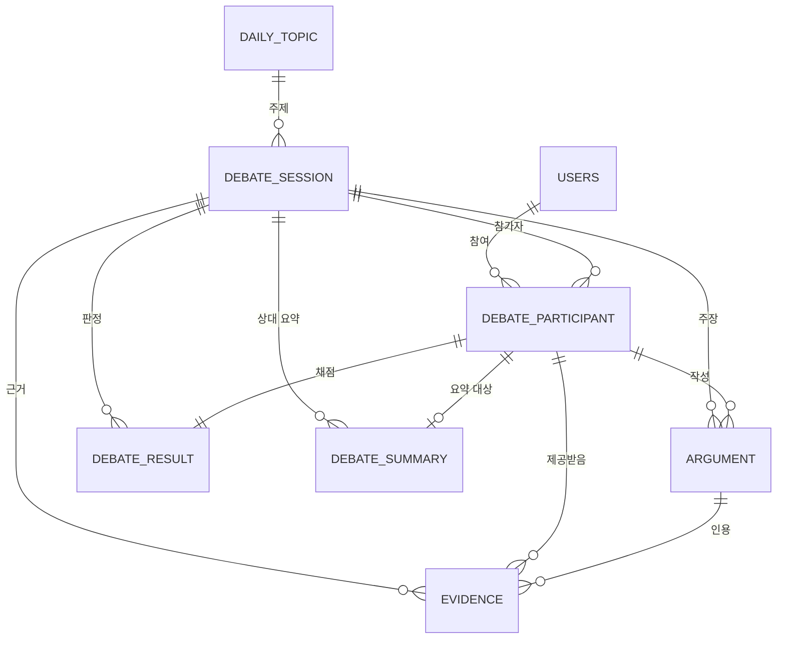

# 야차철학 — ERD & API 명세서 (Final v2)

> Base URL: `https://api.{도메인}/api/v1`
> 인증: ✅ 필수 / 선택 / — 불필요
> MVP 런칭: 10/31
>
> 🔶 **범위 변경 (PVP 우선)**
> - **사람 대 사람(HUMAN) 토론을 먼저 구현**한다. 봇전(AI)은 후순위.
> - 토론은 시간표(2-11)대로 진행되고, 채팅 구간은 **WebSocket(STOMP)** 으로 전송한다.
> - 실시간 관전 · 투표는 **범위에서 제외**한다.
> - 바뀐 부분은 🔶 로 표시했다. 팀 합의가 필요한 것은 **PART 5. 결정 필요**에 모았다.

---

# PART 1. ERD

## 1-1. 전체 관계도



---

## 1-2. MVP 테이블 (8개)

### users — 사용자

| 컬럼 | 타입 | 제약 | 비고 |
| --- | --- | --- | --- |
| id | BIGINT | PK |  |
| email | VARCHAR(255) | UNIQUE, NULL | 게스트는 NULL |
| password | VARCHAR(255) | NULL | 게스트는 NULL |
| nickname | VARCHAR(50) | NN |  |
| is_guest | BOOLEAN | NN |  |
| role | VARCHAR(20) | NN | `USER` / `ADMIN` |
| created_at | DATETIME | NN |  |
| updated_at | DATETIME | NN |  |

> 게스트도 `users` 행을 만든다. 회원 전환 시 같은 행에서 `is_guest = false` → 데이터 이관 불필요.

### daily_topic — 오늘의 야차판 주제

| 컬럼 | 타입 | 제약 | 비고 |
| --- | --- | --- | --- |
| id | BIGINT | PK |  |
| topic_date | DATE | UNIQUE | 하루 한 주제 |
| category | VARCHAR(20) | NN | `ETHICS` / `LOVE` / `SCIENCE` / `SOCIETY` |
| question | TEXT | NN |  |
| option_a | VARCHAR(255) | NN |  |
| option_b | VARCHAR(255) | NN |  |
| created_at | DATETIME | NN |  |

### debate_session — 토론 세션

| 컬럼 | 타입 | 제약 | 비고 |
| --- | --- | --- | --- |
| id | BIGINT | PK |  |
| topic_id | BIGINT | FK, NULL | → daily_topic. 🔶 **`WAITING` 동안은 NULL** — 두 명이 모이면(매칭 성사) 서버가 주제를 배정한다 |
| mode | VARCHAR(20) | NN | `AI` / `HUMAN` — 🔶 **MVP는 HUMAN 먼저** (AI는 후순위) |
| evidence_mode | VARCHAR(20) | NN | `NONE`(키배 ONLY) / `ENABLED`(근거 무기) — 🔶 **유지 여부 결정 필요** (PART 5) |
| status | VARCHAR(20) | NN | `WAITING`(매칭 대기) / `IN_PROGRESS` / `FINISHED` |
| started_at | DATETIME | NULL | 🔶 **매칭 성사 시각.** 현재 구간은 `now - started_at` 으로 계산 |
| finish_reason | VARCHAR(20) | NULL | 🔶 `COMPLETED`(정상 종료) / `FORFEIT`(이탈 몰수패) |
| is_public | BOOLEAN | NN | 공개 페이지 노출 여부 |
| origin_session_id | BIGINT | FK, NULL | 도전장용 — 컬럼만 확보 |
| created_at | DATETIME | NN |  |
| ended_at | DATETIME | NULL |  |

### debate_participant — 참가자

| 컬럼 | 타입 | 제약 | 비고 |
| --- | --- | --- | --- |
| id | BIGINT | PK |  |
| session_id | BIGINT | FK, NN |  |
| user_id | BIGINT | FK, NULL | AI는 NULL |
| participant_type | VARCHAR(20) | NN | `USER` / `AI` |
| role | VARCHAR(20) | NN | `INITIATOR` / `OPPONENT` — 🔶 HUMAN 에서는 먼저 대기한 쪽이 INITIATOR |
| selected_option | VARCHAR(1) | NULL | `A` / `B` — 🔶 HUMAN 은 주제를 매칭 뒤에 받으므로 대기 중에는 NULL. **배정 방식은 결정 필요** (PART 5) |
| joined_at | DATETIME | NN |  |
| disconnected_at | DATETIME | NULL | 🔶 연결이 끊긴 시각. 재접속하면 NULL 로 되돌린다 (이탈 유예 판단용) |

### argument — 주장 (🔶 실시간 채팅 메시지)

| 컬럼 | 타입 | 제약 | 비고 |
| --- | --- | --- | --- |
| id | BIGINT | PK |  |
| session_id | BIGINT | FK, NN |  |
| participant_id | BIGINT | FK, NN |  |
| argument_type | VARCHAR(20) | NN | 🔶 **구간 태그**: `ARGUMENT`(CHAT_1) / `REBUTTAL`(CHAT_2) / `FINAL`(최종변론) |
| seq_no | INT | NN | 🔶 (구 `turn_no`) 세션 내 순번, **서버 채번** |
| content | TEXT | NN | 🔶 `FINAL` 은 **100자 이내** |
| created_at | DATETIME | NN |  |

> 🔶 진행 순서는 시간표(2-11)가 정한다. 기존 3턴(ARGUMENT → REBUTTAL → FINAL)은 **시간 구간**으로 바뀌었다.
> 🔶 `FINAL` 은 참가자당 **1건만** 허용한다. 같은 `argument_type` 의 채팅 행이 여러 개라서 단순 UNIQUE 로는 막을 수 없으므로, 서비스에서 존재 여부를 검사하고 참가자 행을 잠가 직렬화한다.

### evidence — 근거 (🔶 AI 제공)

| 컬럼 | 타입 | 제약 | 비고 |
| --- | --- | --- | --- |
| id | BIGINT | PK |  |
| session_id | BIGINT | FK, NN |  |
| participant_id | BIGINT | FK, NN | 🔶 **참가자별로 다른 근거** (자기 입장에 맞는 3건) |
| used_argument_id | BIGINT | FK, NULL | 실제로 인용한 주장 |
| query_text | VARCHAR(500) | NN |  |
| title | VARCHAR(500) | NN |  |
| url | VARCHAR(1000) | NN |  |
| snippet | TEXT |  |  |
| source_type | VARCHAR(30) | NN | `WEB` / `SCHOLAR` |
| created_at | DATETIME | NN |  |

> 🔶 사용자가 검색하지 않는다. **매칭이 성사되면 서버가 양쪽에 각 3건(총 6행)을 생성**한다.
> 채팅에서 근거를 인용하는 방식(`used_argument_id` 를 언제 채울지)은 프론트와 결정 필요.

### debate_summary — 🔶 상대 발언 요약 (신규)

| 컬럼 | 타입 | 제약 | 비고 |
| --- | --- | --- | --- |
| id | BIGINT | PK |  |
| session_id | BIGINT | FK, NN |  |
| participant_id | BIGINT | FK, NN | **요약의 대상이 된 참가자** (이 참가자의 CHAT_1 발언을 요약해 상대에게 보여준다) |
| content | TEXT | NULL | 생성 전 · 실패 시 NULL |
| status | VARCHAR(20) | NN | `PENDING` / `READY` / `FAILED` |
| created_at | DATETIME | NN |  |

> 반박 질문은 **서버에 저장하지 않는다.** 사용자가 CHAT_2 동안 참고하는 프론트 메모다.

### debate_result — 판정 + 철학자 판독

| 컬럼 | 타입 | 제약 | 비고 |
| --- | --- | --- | --- |
| id | BIGINT | PK |  |
| session_id | BIGINT | FK, NN |  |
| participant_id | BIGINT | FK, NN |  |
| clarity_score | INT | NN | 0~20 |
| logic_score | INT | NN | 0~20 |
| evidence_score | INT | NN | 0~20 |
| rebuttal_score | INT | NN | 0~20 |
| consistency_score | INT | NN | 0~20 |
| total_score | INT | NN | 0~100 |
| result | VARCHAR(10) | NN | `WIN` / `LOSE` / `DRAW` |
| philosopher_name | VARCHAR(100) | NN |  |
| philosopher_percentage | INT | NN |  |
| philosopher_reason | TEXT |  |  |
| matched_sentence | TEXT |  | **사용자가 실제로 쓴 문장** |
| created_at | DATETIME | NN |  |

> 🔴 `UNIQUE(session_id, participant_id)` — PVP 에서는 양쪽을 채점하므로 세션당 2행이 된다.
> 🔶 판정 기준은 **5항목(명료 · 논리 · 근거 · 반박 · 일관성)을 유지**한다. `FORFEIT` 시 점수 컬럼의 NULL 허용 여부는 **결정 필요** (PART 5).

---

## 1-3. 주요 인덱스

| 테이블 | 인덱스 |
| --- | --- |
| daily_topic | `(topic_date)`, `(category, topic_date)` |
| debate_session | `(topic_id, created_at)`, `(is_public, status, ended_at)`, 🔶 `(mode, status, created_at)` — 매칭 대기 조회 (주제와 무관하게 대기열에서 앞선 순서로 짝짓는다) |
| debate_participant | `(user_id)`, `(session_id)` |
| argument | 🔶 `UNIQUE(session_id, seq_no)` |
| evidence | `(session_id, participant_id)`, `(used_argument_id)` |
| debate_summary | 🔶 `UNIQUE(session_id, participant_id)` |

---

## 1-4. ERD 수정 필요 (지금)

| 대상 | 변경 |
| --- | --- |
| `argument` | `crentent` → `content` 오타 수정 |
| `debate_result` | `session_id` UNIQUE → `UNIQUE(session_id, participant_id)` |
| `debate_session` | `is_public`, `evidence_mode` 추가 |
| `daily_topic` | `category` 추가 |
| `users` | `role`, `password` 추가 |
| 🔶 `argument` | `turn_no` → `seq_no`, `UNIQUE(session_id, seq_no)`, `FINAL` 100자 제한 |
| 🔶 `debate_session` | `started_at`, `finish_reason` 추가 |
| 🔶 `debate_participant` | `disconnected_at` 추가 |
| 🔶 `evidence` | 사용자 검색 → 참가자별 AI 제공 3건 |
| 🔶 `debate_summary` | 신규 테이블 |

---

# PART 2. API 명세 (MVP)

## 2-1. 인증 · 사용자

**두 가지 인증 방식을 모두 구현한다.**

| 방식 | 대상 | 저장 |
| --- | --- | --- |
| 세션 (쿠키) | 웹 회원 | Redis (Spring Session) |
| 토큰 (JWT) | 게스트(웹 포함) · 모바일 | 무상태 |

| Method | Path | 설명 | 인증 |
| --- | --- | --- | --- |
| POST | `/auth/signup` | 회원가입 | — |
| POST | `/auth/login` | 로그인 (세션 발급) | — |
| POST | `/auth/logout` | 로그아웃 (세션 만료) | ✅ |
| POST | `/auth/token` | 로그인 (JWT 발급) | — |
| POST | `/auth/token/refresh` | 토큰 재발급 | — |
| POST | `/auth/guest` | 게스트 생성 + JWT 발급 | — |
| POST | `/auth/upgrade` | 게스트 → 회원 승격 | ✅ |
| GET | `/users/me` | 내 정보 · 누적 통계 | ✅ |
| PATCH | `/users/me` | 닉네임 변경 | ✅ |

**로그인 정책 (MVP)**

| 기능 | 게스트 | 회원 |
| --- | --- | --- |
| 토론 (사람 대 사람) | ✅ | ✅ |
| 공개 페이지 열람 | ✅ | ✅ |
| 전투 기록 조회 | ❌ | ✅ |

**확정 — 두 방식을 함께 지원한다**

- [x] **클라이언트별 방식**: 웹 회원은 세션(쿠키), 게스트(웹 포함)와 모바일은 JWT. 같은 `/sessions/**` 를 두 방식이 모두 호출하므로 경로로 나누지 않고 **보안 필터 체인 하나**에서 둘 다 처리한다.
- [x] **`SecurityContext` 통일**: 어느 방식이든 인증에 성공하면 같은 `AuthUser`(id, role)를 `SecurityContext` 에 넣는다. 컨트롤러 · 서비스는 인증 방식을 모른다.
- [x] **우선순위**: 요청에 `Authorization: Bearer` 헤더가 있으면 JWT 가 우선하고, 없으면 세션에 저장된 인증을 읽는다.
- [x] 🔶 **WebSocket 사용자 식별**: `/ws` 핸드셰이크는 열어 둔다(JWT 클라이언트는 핸드셰이크에 헤더를 못 붙인다). 핸드셰이크에 실린 **세션 쿠키**가 있으면 그 사용자로, 없으면 **STOMP CONNECT 프레임의 `Authorization` 헤더 JWT** 로 식별한다. 참가자 검증은 SUBSCRIBE 때 한다 (2-12).

**개발하면서 결정** — 인증을 구현하는 PR 에서 정하고 이 목록을 갱신한다.

- [ ] **CSRF 방어 방식** — 쿠키로 인증된 요청에만 CSRF 토큰을 요구하고 `Bearer` 요청은 제외할지, `SameSite` 쿠키 + CORS 출처 제한으로 갈지. 프론트 · 도메인 구성과 함께 정한다.
- [ ] **세션 저장소** — 명세는 Redis(Spring Session). 서버 1대인 동안 인메모리로 시작할지(재배포 시 로그인 풀림), 처음부터 Redis 를 둘지. Redis 를 쓰면 Docker 환경에도 추가해야 한다.
- [ ] **로그아웃 범위** — 세션은 만료시키면 되지만 JWT 는 무상태다. 리프레시 토큰을 서버에서 무효화할지.

---

## 2-2. 주제 · 카테고리

| Method | Path | 설명 | 인증 |
| --- | --- | --- | --- |
| GET | `/topics/today` | 오늘의 야차판 + A/B 선택 현황 | — |
| GET | `/topics` | 주제 목록 (카테고리 · 페이징) | — |
| GET | `/topics/{id}` | 주제 상세 | — |
| GET | `/categories` | 카테고리 목록 | — |

---

## 2-3. 토론 세션 (🔶 HUMAN)

| Method | Path | 설명 | 인증 |
| --- | --- | --- | --- |
| POST | `/sessions` | 🔶 토론 시작 — 매칭 대기열 진입 또는 성사 (HUMAN 은 주제를 고르지 않는다) | 선택 |
| GET | `/sessions/{id}` | 세션 상세 | 선택 |
| GET | `/sessions/{id}/state` | 🔶 현재 구간 · 남은 시간 · `serverNow` (재접속 · 새로고침용) | 선택 |
| DELETE | `/sessions/{id}` | 🔶 매칭 대기 취소 (`WAITING` 일 때만) | 선택 |
| POST | `/sessions/{id}/finish` | 종료 → 판정 요청 (🔶 **봇전 전용** — HUMAN 은 서버가 시간표대로 종료) | 선택 |
| GET | `/sessions/me` | 전투 기록 | ✅ |

> 🔶 사용자는 참가자 검증을 받으므로, 비회원은 **`/auth/guest` 로 JWT 를 받은 뒤** 호출해야 한다. 토큰 없는 완전 익명은 지원하지 않는다.

**세션 생성 옵션 (HUMAN)**

```json
{ "mode": "HUMAN" }
```

**매칭 규칙 — 두 명이 모이면 서버가 주제를 준다**

- 🔶 사용자는 주제도 진영(A/B)도 고르지 않고 대기열에 들어간다. **두 사람이 모인 뒤에** 서버가 주제를 배정한다.
- `WAITING` 세션이 있으면 그 세션에 참가한다. 없으면 내가 새 `WAITING` 세션을 만든다. (`topic_id` 는 NULL)
- 성사 시 서버가 **주제를 배정**하고 양쪽에 `MATCHED` 이벤트로 알린다. 주제 선정 규칙과 A/B 진영 배정 방식은 **결정 필요** (PART 5).
- 두 명이 같은 대기 세션을 동시에 잡는 경합은 **원자적 UPDATE** 로 막는다. `status = 'WAITING'` 조건의 UPDATE 가 **1건 갱신된 쪽만** 성공한다.
- 성공하면 `started_at` 기록 → `IN_PROGRESS` → 근거 생성 시작 → 양쪽에 `MATCHED` 이벤트를 푸시한다.
- 이미 대기 중이거나 진행 중인 세션이 있는 사용자는 `ALREADY_IN_SESSION`.

> 봇전(AI) 모드는 후순위다. 그때는 사용자 참가자와 AI 참가자를 **한 트랜잭션에서 함께 만들고**, AI 의 `selected_option` 은 사용자의 반대편으로 자동 지정한다.

---

## 2-4. 실시간 채팅 · 최종변론 (🔶 WebSocket)

**REST**

| Method | Path | 설명 | 인증 |
| --- | --- | --- | --- |
| GET | `/sessions/{id}/messages?afterSeq=N` | 메시지 조회 — 재접속 · 누락 보충 (`seq_no > N`, 오름차순) | 선택 |

**WebSocket (STOMP)**

| 방향 | 목적지 | 설명 |
| --- | --- | --- |
| SEND | `/app/sessions/{id}/chat` | 채팅 전송 — `CHAT_1`, `CHAT_2` 구간에서만 |
| SEND | `/app/sessions/{id}/final` | 최종변론 제출 — `FINAL` 구간, **1인 1회, 100자 이내** |
| SUBSCRIBE | `/topic/sessions/{id}` | 채팅 · 구간 · 종료 이벤트 |
| SUBSCRIBE | `/user/queue/match` | 매칭 성사 알림 (대기 중인 사용자) |

**서버 검증**

- 요청자가 이 세션의 참가자인가 — **SUBSCRIBE 때도 검사한다** (안 하면 남의 토론을 엿볼 수 있다)
- 현재 구간이 허용하는 동작인가 (`INVALID_PHASE`) — 구간 판단은 **서버 수신 시각** 기준
- `seq_no` 는 **서버가 채번** (클라이언트 값 신뢰 금지)
- `FINAL` 은 100자 이내, 참가자당 1건
- **저장 → 커밋 → 브로드캐스트** 순서. 브로드캐스트한 메시지는 반드시 DB 에 있다
- 채팅 1건의 글자 수 상한과 도배 제한은 결정 필요 (PART 5)

**이벤트 형식**

```json
{ "type": "CHAT", "seqNo": 12, "senderId": 7, "phase": "CHAT_1", "content": "..." }
{ "type": "PHASE_CHANGED", "phase": "REBUTTAL", "endsAt": "2026-10-31T12:04:30Z", "serverNow": "2026-10-31T12:04:00Z" }
{ "type": "OPPONENT_DISCONNECTED", "graceEndsAt": "2026-10-31T12:05:00Z" }
{ "type": "SESSION_FINISHED", "reason": "COMPLETED" }
```

> 재접속하면 `GET /sessions/{id}/state` 로 구간을 맞추고 `GET /sessions/{id}/messages?afterSeq=` 로 놓친 메시지를 채운다.

---

## 2-5. LINER 근거 (🔶 AI 제공)

| Method | Path | 설명 | 인증 |
| --- | --- | --- | --- |
| GET | `/sessions/{id}/evidence` | 🔶 **내 근거 3건** (생성 중이면 `{ "status": "PENDING" }`) | 선택 |

**구현 메모**

- 매칭 성사 직후 서버가 양쪽에 각 3건을 생성한다. **PREP 60초 안에 끝내는 것이 목표.**
- 근거 검색(`POST /evidence`)과 문장 자동 작성(`compose`)은 **HUMAN 시간표에서 제거**했다. 봇전에서 필요한지는 그때 결정한다.
- **API 키는 서버에서만 사용. 프론트 노출 금지**
- 실패 정책은 2-9 의 LLM 재시도 정책을 따른다.

### 2-5-1. 상대 요약 (🔶 신규)

| Method | Path | 설명 | 인증 |
| --- | --- | --- | --- |
| GET | `/sessions/{id}/summary` | 상대 발언 요약 — `PENDING` / `READY` / `FAILED` | 선택 |

- `CHAT_1` 이 끝나는 시점에 서버가 각 참가자의 발언을 요약해 **상대에게** 보여준다.
- `REBUTTAL` 30초 안에 나와야 한다. 실패하면 `FAILED` 로 두고, 프론트는 `/messages` 로 상대의 마지막 발언 몇 건을 원문 그대로 보여준다.

---

## 2-6. 판정 결과

| Method | Path | 설명 | 인증 |
| --- | --- | --- | --- |
| GET | `/sessions/{id}/result` | AI 판정 점수 + 철학자 판독 | 선택 |

**생성 규칙**

- 각 항목 20점 만점, `total_score` = 5개 합 (0~100) — 🔶 5항목 기준 유지로 확정
- `result` 는 총점 구간으로 판정 (제안: 80↑ WIN / 60~79 DRAW / 60↓ LOSE) — **구간 합의 필요**. 경계값 60 이 DRAW 인지 LOSE 인지도 정할 것
- `matched_sentence` 는 **사용자가 실제로 쓴 문장**을 그대로 넣는다. LLM이 지어내지 않도록 프롬프트에서 원문 문장만 고르도록 제약할 것
- 생성 중이면 `{ "status": "PENDING" }` 반환
- 🔶 `FINAL` 구간이 끝나면 서버가 판정을 시작한다. **`FORFEIT` 는 LLM 판정을 생략**하고 남은 쪽을 `WIN`, 이탈자를 `LOSE` 로 한다.

---

## 2-7. 공개 페이지

| Method | Path | 설명 | 인증 |
| --- | --- | --- | --- |
| GET | `/public/sessions` | 종료된 토론 목록 | — |
| GET | `/public/sessions/{id}` | 공개 토론 상세 | — |

> 🔴 애드센스 심사와 검색 유입의 핵심.
> 로그인 없이 전체 내용이 보여야 하고, **SSR 또는 메타태그 처리가 필요**하다. 프론트와 합의할 것.

---

## 2-8. 관리자

| Method | Path | 설명 | 인증 |
| --- | --- | --- | --- |
| PATCH | `/admin/sessions/{id}/visibility` | 세션 공개 여부 변경 | ADMIN |

> 신고 기능 전체는 2차지만, **문제 있는 내용을 공개 페이지에서 내리는 수단**은 운영 기간에 반드시 필요하다.

---

## 2-9. 공통 규약

**응답 래퍼**

```json
{ "success": true, "data": { }, "error": null, "traceId": "a1b2c3d4e5f60718" }
```

```json
{ "success": false, "data": null,
  "error": { "code": "SESSION_NOT_FOUND", "message": "토론을 찾을 수 없습니다" },
  "traceId": "a1b2c3d4e5f60718" }
```

> 🔶 `traceId` 는 요청 추적용이며 응답 헤더 `X-Trace-Id` 로도 내려간다. 문제가 생기면 이 값으로 서버 로그를 찾는다.

**비동기**: LLM 호출은 `202 Accepted` 반환 후 폴링 (제안 간격 1.5초, 30초 타임아웃). 🔶 근거 · 요약 · 판정은 `PENDING` / `READY` / `FAILED` 상태를 조회 API 로 확인한다.

**🔶 LLM 재시도 정책 (제안)**

재시도는 **타임아웃 · 5xx · 429** 에만 한다. 4xx 는 즉시 실패로 처리한다.

| 호출 | 시도당 타임아웃 | 최대 시도 | 최종 실패 시 |
| --- | --- | --- | --- |
| 근거 3건 (PREP 60초 안) | 10초 | 3 | 근거 없이 진행 |
| 상대 요약 (REBUTTAL 30초 안) | 10초 | 2 | 상대 발언 원문 표시 (`FAILED`) |
| 판정 | 10초 | 3 | `FAILED`, 재요청 허용 |

> 시도 횟수는 **구간의 남은 시간**이 정한다. 요약은 10초씩 3번이면 30초 구간을 넘기므로 2번이 한계다.

**에러 코드**

| 코드 | HTTP | 상황 |
| --- | --- | --- |
| `TOPIC_NOT_FOUND` | 404 | 해당 날짜 주제 없음 |
| `SESSION_NOT_FOUND` | 404 |  |
| `NOT_PARTICIPANT` | 403 | 내 세션이 아님 |
| `INVALID_PHASE` | 409 | 🔶 (구 `INVALID_TURN`) 현재 구간에서 허용되지 않는 동작 |
| `SESSION_FINISHED` | 409 | 이미 종료됨 |
| `ALREADY_IN_SESSION` | 409 | 🔶 이미 대기 중이거나 진행 중인 세션이 있음 |
| `SESSION_NOT_WAITING` | 409 | 🔶 대기 중이 아닌 세션을 취소하려 함 |
| `FINAL_ALREADY_SUBMITTED` | 409 | 🔶 최종변론은 1회만 가능 |
| `CONTENT_TOO_LONG` | 400 | 🔶 글자 수 초과 (최종변론 100자 등) |

> 🔶 `EVIDENCE_LIMIT_EXCEEDED` 는 근거 검색이 사라져 제거했다.

---

## 2-10. 전체 호출 흐름 (🔶 HUMAN)

```
GET  /topics/today
POST /auth/guest                          (비회원)
POST /sessions                            { mode: "HUMAN" } → WAITING 또는 IN_PROGRESS  (주제는 매칭 성사 뒤 서버가 배정)
WS   CONNECT /ws                          (인증)
WS   SUBSCRIBE /user/queue/match          → MATCHED { sessionId }
WS   SUBSCRIBE /topic/sessions/{id}
GET  /sessions/{id}/state                 (현재 구간 · 남은 시간)
GET  /sessions/{id}/evidence              (PREP: 내 근거 3건, 폴링)
WS   SEND /app/sessions/{id}/chat         (CHAT_1, CHAT_2)
GET  /sessions/{id}/summary               (REBUTTAL: 상대 요약, 폴링)
WS   SEND /app/sessions/{id}/final        (FINAL: 100자, 1회)
GET  /sessions/{id}/result                (폴링)
GET  /sessions/{id}/messages?afterSeq=N   (재접속 시)
```

**봇전(AI) 흐름 — 후순위, HUMAN 확정 후 재설계**

```
POST /sessions                            { topicId, selectedOption, mode: "AI", evidenceMode }
POST /sessions/{id}/finish
GET  /sessions/{id}/result                (폴링)
```

---

## 2-11. 토론 진행 시간표 (🔶 신규)

| 구간 | 길이 | 누적 | 채팅 | 서버 동작 |
| --- | --- | --- | --- | --- |
| `PREP` | 60초 | 0~60 | ✕ | 주제 표시. 매칭 직후 양쪽 근거 3건 생성 |
| `CHAT_1` (ARGUMENT) | 180초 | 60~240 | ○ | 실시간 채팅으로 주장 |
| `REBUTTAL` | 30초 | 240~270 | ✕ | `CHAT_1` 종료 시 상대 요약 생성. 반박 질문은 프론트 메모 |
| `CHAT_2` (REBUTTAL) | 180초 | 270~450 | ○ | 실시간 채팅으로 반박 |
| `FINAL` | 30초 | 450~480 | ✕ | 채팅 정지. **참가자당 100자 이내 1건**만 제출 |
| `JUDGING` | — | 480~ | — | 판정 (FORFEIT 이면 생략) |

전체 토론은 **8분** + 판정 시간이다.

**서버 규칙**

- 현재 구간은 `now - started_at` 으로 **계산**한다. 서버가 재시작돼도 상태가 깨지지 않는다.
- 구간 전환 알림(`PHASE_CHANGED`)과 LLM 호출 시작은 **스케줄러**가 맡는다. 재시작 시 `IN_PROGRESS` 세션을 다시 등록한다.
- **마감 시각의 기준은 서버.** 마감 이후에 도착한 메시지는 거부한다.

**이탈 처리 — 유예 후 몰수패**

1. WebSocket 연결이 끊기면 `disconnected_at` 을 기록하고 상대에게 `OPPONENT_DISCONNECTED` 를 보낸다.
2. 유예 시간(제안: 30초) 안에 재접속하면 `disconnected_at` 을 NULL 로 되돌린다.
3. 유예가 지나면 세션을 `FINISHED`, `finish_reason = FORFEIT` 로 종료한다. 이탈자 `LOSE`, 남은 사람 `WIN`.
4. 매칭 대기(`WAITING`) 중에 나가면 대기를 취소한다.

## 2-12. WebSocket(STOMP) 규약 (🔶 신규)

| 항목 | 값 |
| --- | --- |
| 엔드포인트 | `/ws` |
| 앱 목적지 접두사 | `/app` |
| 브로커 목적지 | `/topic`, `/queue` |
| 브로커 | 서버 1대는 내장 simple broker. **서버를 여러 대로 늘리면 외부 브로커 필요** |
| 인증 | `/ws` 핸드셰이크는 열어 두고, 사용자는 **핸드셰이크의 세션 쿠키**, 없으면 **CONNECT 프레임의 `Authorization` JWT** 로 식별한다 (2-1). 쿠키를 쓰므로 핸드셰이크에서 `Origin` 을 검사한다 |
| 구독 인가 | SUBSCRIBE 시 해당 세션의 참가자인지 검사 |
| 의존성 | `spring-boot-starter-websocket` 추가 필요 |

---

# PART 3. 2차 (런칭 후)

| 기능 | 내용 | 필요 테이블 |
| --- | --- | --- |
| **도전장 공유** | 링크로 친구에게 반박 요청 | `challenge_link` |
| **알림** | 07~09시 · 17~19시 푸시 | `push_subscription`, `notification_setting`, `notification` |
| **밸런스 게임** | 카드 선택 → MBTI 철학 결과 | `balance_card`, `balance_result` |
| **1분 철학** | 기본(매일) · 시사(주 1회) | `daily_philosophy` |
| **신고 · 차단** | 주장 신고, 사용자 차단 | `report`, `user_block` |
| **봇전 (AI 토론)** | AI 반박, 근거 검색 · compose | — |

> 🔶 **PVP 실시간 토론은 MVP 로 이동**했다. **실시간 관전 · 투표는 범위에서 제외**한다 (`vote` 테이블도 불필요).
> 🔴 **실시간 토론과 신고 기능은 세트로 연다.** PVP 를 먼저 여는 만큼 `report`, `user_block` 을 MVP 에 넣을지 **결정 필요** (PART 5).

---

# PART 4. 역할 분담 (백엔드 3명)

|  | 담당 | 주요 작업 |
| --- | --- | --- |
| **A** | 인증 · 토론 코어 | 세션/JWT 인증, 게스트, 토론 세션, 주장 |
| **B** | 콘텐츠 · 공개 영역 | 주제·카테고리, 공개 페이지, 관리자, 지표 집계 |
| **C** | 인프라 · 외부 연동 | 배포/CI-CD, LINER 연동, AI 반박, 판정 생성 |

### 배치 근거

**A — 인증은 다른 모든 API의 전제**라 가장 먼저 끝나야 한다. 세션·주장도 초반에 만들어야 하는 코어라 같은 구간에 묶었다. A는 10/12~10/23 시험 기간이 있어 **앞쪽에 몰린 작업**을 맡는 것이 맞다.

**B — 공개 페이지가 MVP의 숨은 핵심.** 애드센스 심사와 검색 유입이 여기 걸려 있다. 주제 관리와 지표 집계도 함께 맡고, 여유가 생기면 2차 실시간 설계를 미리 시작한다.

**C — 배포는 초반에 몰리고 중반에 비는 작업**이라 외부 연동 전반을 함께 맡는다. LINER 호출이 검색·compose·AI 반박·판정까지 네 군데라 한 사람이 모아서 보는 편이 비동기 큐와 API 비용 관리에 유리하다.

> 🔶 **PVP 우선으로 바뀐 영향**
> - C 의 외부 연동은 `근거 3건 생성 · 상대 요약 · 판정` 3곳이 된다. AI 반박과 compose 는 후순위.
> - **매칭 · 구간 스케줄러 · WebSocket 채팅**은 A 의 영역(세션 · 주장)인데 A 는 10/12~10/23 시험이다. **10/11 까지 이 범위가 배포 환경에서 동작해야** 하므로 분담과 일정을 다시 잡아야 한다.

---

## 주차별 일정

| 주차 | A | B | C |
| --- | --- | --- | --- |
| 9/21~9/27 | 인증(세션+JWT)·게스트 | 주제·카테고리 API | **배포 파이프라인 + 도메인** |
| 9/28~10/4 | 세션 생성·참가자 | 공개 페이지 | LINER 검색 연동 |
| 10/5~10/11 | 주장·턴 검증 | 관리자 도구·지표 쿼리 | AI 반박·판정 |
| 10/12~10/18 | ⚠️ 시험 | 공개 페이지 SSR 대응 | compose API·안정화 |
| 10/19~10/23 | ⚠️ 시험 | 2차 실시간 설계 | 운영 점검·모니터링 |
| 10/24~10/30 | 복귀·통합 | 통합 테스트 | 런칭 준비 |
| **10/31** | **런칭** |  |  |
| 11/1~ | 운영 대응 | 도전장 → PVP → 관전 | 지표·알림 |

> 🔶 이 일정표는 봇전 기준이라 **아직 갱신하지 않았다.** PVP 우선 범위로 다시 짜야 한다.

---

## 꼭 지킬 것

**9/25까지 API 명세 고정.** 프론트가 목 데이터로 작업하려면 응답 형태가 먼저 정해져야 한다.

**배포는 9월 안에.** 빈 서버라도 좋으니 파이프라인부터 돌려놓는다. 도메인이 살아 있어야 결제·광고 심사를 넣을 수 있고, 그 심사가 각각 일주일에서 한 달씩 걸린다.

**🔴 A의 시험 기간 대비 인수인계 (10/11까지)**

- 담당 API가 배포 환경에서 동작하는 상태로 만들기
- 배포 권한과 절차를 C와 공유 — 한 사람만 할 수 있으면 팀이 멈춘다
- 미완성 부분을 이슈로 남기기

**유입 장치가 MVP에 없다는 점을 인지할 것.** 도전장 공유가 2차로 빠지면서, 10/31 런칭 시점에 사용자를 데려오는 기능이 없다. 운영 3주가 평가 대상이므로 **도전장을 11월 첫 주에 최우선으로 여는 것**을 권한다.

---

# PART 5. 결정 필요 (🔶 PVP 우선으로 새로 생긴 것)

- [ ] **`evidence_mode` 유지 여부** — 근거를 AI 가 항상 제공하므로 `NONE` / `ENABLED` 구분이 필요한지. 유지하면 매칭 때 양쪽 값이 다를 수 있다.
- [x] **판정 기준** — 5항목(명료 · 논리 · 근거 · 반박 · 일관성)을 **유지**한다. (확정)
- [x] **매칭 방식** — 두 명이 모이면 서버가 주제를 준다. 사용자가 미리 주제를 고르지 않는다. (확정)
- [ ] **주제 선정 규칙** — 🔶 매칭 성사 때 어떤 주제를 주는지. 오늘의 야차판(`daily_topic`, 하루 한 주제)을 그대로 쓰는지, 여러 주제 중 무작위인지.
- [ ] **A/B 진영 배정** — 🔶 주제를 받은 뒤 누가 A 이고 B 인지(무작위 · 먼저 대기한 쪽 우선 · 본인이 선택 등). `selected_option` 과 `INITIATOR` 규칙에 영향.
- [ ] **`/topics/today` 의 "A/B 선택 현황"** — 🔶 사용자가 미리 진영을 고르지 않으므로 이 응답과 화면이 어떻게 바뀌는지.
- [ ] **`FORFEIT` 결과 저장** — 점수 · 철학자 컬럼을 NULL 허용으로 바꿀지, `finish_reason` 만으로 처리할지.
- [ ] **신고 · 차단 범위** — `report`, `user_block` 을 MVP 에 포함할지.
- [ ] **이탈 유예 시간** — 제안 30초. 양쪽이 동시에 이탈한 경우의 처리도 필요.
- [ ] **매칭 대기 정책** — 대기 시간 제한, 봇전으로 대체할지. (A/B 쏠림은 진영을 매칭 뒤에 배정하므로 문제가 되지 않는다)
- [ ] **채팅 제한** — 메시지 1건의 글자 수 상한, 도배 제한.
- [ ] **근거 인용 방식** — 채팅에서 근거를 인용할 때 `used_argument_id` 를 언제 채울지.
- [ ] **일정 · 담당 재조정** — 매칭 · 스케줄러 · WebSocket 채팅을 A 의 시험 기간 전에 끝낼 수 있는지.
