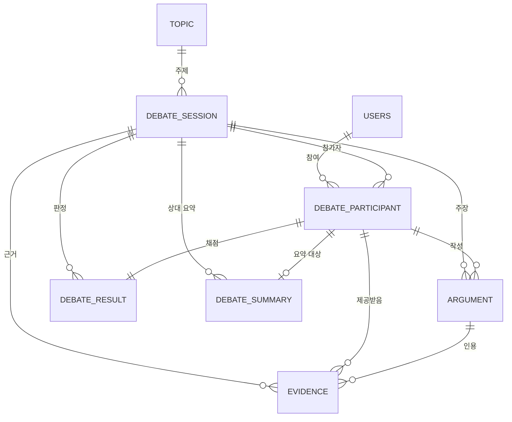
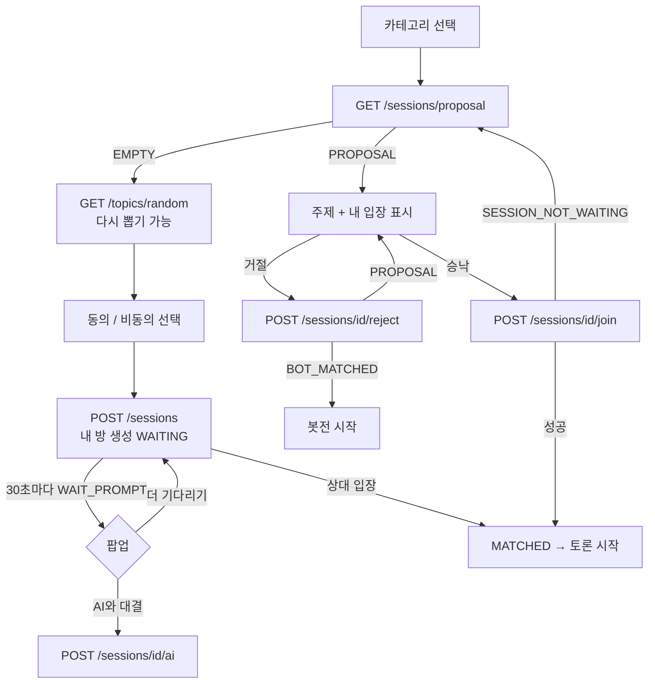

# 야차철학 — ERD & API 명세서 (Final v2)

> Base URL: `https://api.{도메인}/api/v1`
> 인증: ✅ 필수 (게스트 토큰 포함) / 선택 / — 불필요
> MVP 런칭: 10/31
>
> 🔶 **범위 변경 (PVP 우선)**
> - **사람 대 사람(HUMAN) 토론을 먼저 구현**한다.
> - 토론은 시간표(2-11)대로 진행되고, 채팅 구간은 **WebSocket(STOMP)** 으로 전송한다.
> - 실시간 관전 · 투표는 **범위에서 제외**한다.
> - 바뀐 부분은 🔶 로 표시했다. 팀 합의가 필요한 것은 **PART 5. 결정 필요**에 모았다.
>
> 🔷 **매칭 플로우 개정 (9/27)**
> - 대기열 자동 매칭 → **방 기반 매칭**. 랜덤 야차(자동 제안 · 방 찾기)와 친구와 야차(초대 링크) 두 가지로 나뉜다 (2-3).
> - 대기 30초마다 봇전 전환을 제안하고, 제안을 계속 거절하면 봇전으로 자동 매칭하므로 **봇전(AI)이 MVP 로 들어온다**.
> - 주제는 카테고리 **8개**의 주제 풀에서 뽑고, 입장은 **동의 / 비동의**로 나눈다.
> - 인증은 **JWT 로 통일**됐다 (PR #15). 세션 관련 내용을 정리했다 (2-1).
> - 이번에 바뀐 부분은 🔷 로 표시했다.

---

# PART 1. ERD

## 1-1. 전체 관계도



---

## 1-2. MVP 테이블 (8개)

### users — 사용자

| 컬럼 | 타입 | 제약 | 비고 |
| --- | --- | --- | --- |
| id | BIGINT | PK |  |
| email | VARCHAR(255) | UNIQUE, NULL | 게스트는 NULL |
| password | VARCHAR(255) | NULL | 게스트는 NULL |
| nickname | VARCHAR(50) | NN |  |
| is_guest | BOOLEAN | NN |  |
| role | VARCHAR(20) | NN | `USER` / `ADMIN` |
| created_at | DATETIME | NN |  |
| updated_at | DATETIME | NN |  |

> 게스트도 `users` 행을 만든다. 회원 전환 시 같은 행에서 `is_guest = false` → 데이터 이관 불필요.

### topic — 🔷 주제 풀 (구 `daily_topic`)

| 컬럼 | 타입 | 제약 | 비고 |
| --- | --- | --- | --- |
| id | BIGINT | PK |  |
| category | VARCHAR(20) | NN | 🔷 **8개로 확정**. 값(이름)은 결정 필요 (PART 5) |
| statement | TEXT | NN | 🔷 동의 / 비동의로 답하는 **명제** (구 `question` + `option_a` / `option_b`) |
| is_active | BOOLEAN | NN | 🔷 랜덤 추첨 대상 여부. 내린 주제는 `false` |
| created_at | DATETIME | NN |  |

> 🔷 하루 한 주제(`topic_date`)가 아니라 **카테고리별 주제 풀**이다. 랜덤 야차 · 친구와 야차 · 봇전 모두 여기서 뽑는다.
> 오늘의 야차판(`/topics/today`)을 유지할지는 결정 필요 (PART 5).

### debate_session — 토론 세션

| 컬럼 | 타입 | 제약 | 비고 |
| --- | --- | --- | --- |
| id | BIGINT | PK |  |
| topic_id | BIGINT | FK, NULL | → topic. 🔷 **랜덤 방은 생성 시 채운다.** 친구 방만 친구가 입장할 때까지 NULL |
| category | VARCHAR(20) | NN | 🔷 방을 만들 때 고른 카테고리. 자동 제안 · 방 찾기 · 봇전 주제 추첨의 기준 |
| room_type | VARCHAR(20) | NN | 🔷 `RANDOM`(랜덤 야차) / `FRIEND`(친구와 야차) |
| invite_code | VARCHAR(32) | UNIQUE, NULL | 🔷 친구 방 초대 코드. `RANDOM` 은 NULL. 만료는 `created_at + 10분` |
| mode | VARCHAR(20) | NN | `AI` / `HUMAN` — 🔷 **둘 다 MVP**. 대기 중 AI 전환 · 자동 봇전이면 `AI` 로 바뀐다 |
| evidence_mode | VARCHAR(20) | NN | `NONE`(키배 ONLY) / `ENABLED`(근거 무기) — 🔶 **유지 여부 결정 필요** (PART 5) |
| status | VARCHAR(20) | NN | `WAITING`(대기) / `IN_PROGRESS` / `FINISHED` / 🔷 `CANCELLED`(대기 취소 · 5분 상한 · 초대 만료) |
| started_at | DATETIME | NULL | 🔶 **매칭 성사 시각.** 현재 구간은 `now - started_at` 으로 계산 |
| finish_reason | VARCHAR(20) | NULL | 🔶 `COMPLETED`(정상 종료) / `FORFEIT`(이탈 몰수패) |
| is_public | BOOLEAN | NN | 공개 페이지 노출 여부 |
| origin_session_id | BIGINT | FK, NULL | 도전장용 — 컬럼만 확보 |
| created_at | DATETIME | NN | 🔷 **대기 타이머의 기준.** 30초 팝업 · 5분 상한 · 초대 10분 만료를 모두 여기서 계산 |
| ended_at | DATETIME | NULL |  |

### debate_participant — 참가자

| 컬럼 | 타입 | 제약 | 비고 |
| --- | --- | --- | --- |
| id | BIGINT | PK |  |
| session_id | BIGINT | FK, NN |  |
| user_id | BIGINT | FK, NULL | AI는 NULL |
| participant_type | VARCHAR(20) | NN | `USER` / `AI` |
| role | VARCHAR(20) | NN | `INITIATOR` / `OPPONENT` — 🔷 방을 만든 사람(방장)이 INITIATOR |
| stance | VARCHAR(10) | NULL | 🔷 `AGREE` / `DISAGREE` (구 `selected_option`). 배정 규칙은 아래 |
| joined_at | DATETIME | NN |  |
| disconnected_at | DATETIME | NULL | 🔶 연결이 끊긴 시각. 재접속하면 NULL 로 되돌린다 (이탈 유예 판단용) |

> 🔷 **`stance` 배정 규칙**
>
> | 경우 | 방장 (INITIATOR) | 상대 (OPPONENT) |
> | --- | --- | --- |
> | 랜덤 야차 | 방을 만들 때 **직접 선택** | 방장의 **반대** (자동 제안 · 방 찾기 모두) |
> | 친구와 야차 | 친구 입장 시 **서버가 무작위** | 방장의 반대 |
> | 대기 중 AI 전환 | 이미 선택한 값 유지 | AI 참가자가 반대 |
> | 자동 봇전 | **서버가 무작위** | AI 참가자가 반대 |
>
> 친구 방은 친구가 들어올 때까지 방장의 `stance` 가 NULL 이다.

### argument — 주장 (🔶 실시간 채팅 메시지)

| 컬럼 | 타입 | 제약 | 비고 |
| --- | --- | --- | --- |
| id | BIGINT | PK |  |
| session_id | BIGINT | FK, NN |  |
| participant_id | BIGINT | FK, NN |  |
| argument_type | VARCHAR(20) | NN | 🔶 **구간 태그**: `ARGUMENT`(CHAT_1) / `REBUTTAL`(CHAT_2) / `FINAL`(최종변론) |
| seq_no | INT | NN | 🔶 (구 `turn_no`) 세션 내 순번, **서버 채번** |
| content | TEXT | NN | 🔶 `FINAL` 은 **100자 이내** |
| created_at | DATETIME | NN |  |

> 🔶 진행 순서는 시간표(2-11)가 정한다. 기존 3턴(ARGUMENT → REBUTTAL → FINAL)은 **시간 구간**으로 바뀌었다.
> 🔶 `FINAL` 은 참가자당 **1건만** 허용한다. 같은 `argument_type` 의 채팅 행이 여러 개라서 단순 UNIQUE 로는 막을 수 없으므로, 서비스에서 존재 여부를 검사하고 참가자 행을 잠가 직렬화한다.

### evidence — 근거 (🔶 AI 제공)

| 컬럼 | 타입 | 제약 | 비고 |
| --- | --- | --- | --- |
| id | BIGINT | PK |  |
| session_id | BIGINT | FK, NN |  |
| participant_id | BIGINT | FK, NN | 🔶 **참가자별로 다른 근거** (자기 입장에 맞는 3건) |
| used_argument_id | BIGINT | FK, NULL | 실제로 인용한 주장 |
| query_text | VARCHAR(500) | NN |  |
| title | VARCHAR(500) | NN |  |
| url | VARCHAR(1000) | NN |  |
| snippet | TEXT |  |  |
| source_type | VARCHAR(30) | NN | `WEB` / `SCHOLAR` |
| created_at | DATETIME | NN |  |

> 🔶 사용자가 검색하지 않는다. **매칭이 성사되면 서버가 양쪽에 각 3건(총 6행)을 생성**한다.
> 채팅에서 근거를 인용하는 방식(`used_argument_id` 를 언제 채울지)은 프론트와 결정 필요.

### debate_summary — 🔶 상대 발언 요약 (신규)

| 컬럼 | 타입 | 제약 | 비고 |
| --- | --- | --- | --- |
| id | BIGINT | PK |  |
| session_id | BIGINT | FK, NN |  |
| participant_id | BIGINT | FK, NN | **요약의 대상이 된 참가자** (이 참가자의 CHAT_1 발언을 요약해 상대에게 보여준다) |
| content | TEXT | NULL | 생성 전 · 실패 시 NULL |
| status | VARCHAR(20) | NN | `PENDING` / `READY` / `FAILED` |
| created_at | DATETIME | NN |  |

> 반박 질문은 **서버에 저장하지 않는다.** 사용자가 CHAT_2 동안 참고하는 프론트 메모다.

### debate_result — 판정 + 철학자 판독

| 컬럼 | 타입 | 제약 | 비고 |
| --- | --- | --- | --- |
| id | BIGINT | PK |  |
| session_id | BIGINT | FK, NN |  |
| participant_id | BIGINT | FK, NN |  |
| clarity_score | INT | NN | 0~20 |
| logic_score | INT | NN | 0~20 |
| evidence_score | INT | NN | 0~20 |
| rebuttal_score | INT | NN | 0~20 |
| consistency_score | INT | NN | 0~20 |
| total_score | INT | NN | 0~100 |
| result | VARCHAR(10) | NN | `WIN` / `LOSE` / `DRAW` |
| philosopher_name | VARCHAR(100) | NN |  |
| philosopher_percentage | INT | NN |  |
| philosopher_reason | TEXT |  |  |
| matched_sentence | TEXT |  | **사용자가 실제로 쓴 문장** |
| created_at | DATETIME | NN |  |

> 🔴 `UNIQUE(session_id, participant_id)` — PVP 에서는 양쪽을 채점하므로 세션당 2행이 된다.
> 🔶 판정 기준은 **5항목(명료 · 논리 · 근거 · 반박 · 일관성)을 유지**한다. `FORFEIT` 시 점수 컬럼의 NULL 허용 여부는 **결정 필요** (PART 5).

---

## 1-3. 주요 인덱스

| 테이블 | 인덱스 |
| --- | --- |
| topic | 🔷 `(category, is_active)` — 카테고리 안 랜덤 추첨 |
| debate_session | `(topic_id, created_at)`, `(is_public, status, ended_at)`, 🔷 `(room_type, status, category, created_at)` — 대기열 조회 (자동 제안 · 방 찾기가 오래된 순서로 읽는다), 🔷 `UNIQUE(invite_code)` |
| debate_participant | `(user_id)`, `(session_id)` |
| argument | 🔶 `UNIQUE(session_id, seq_no)` |
| evidence | `(session_id, participant_id)`, `(used_argument_id)` |
| debate_summary | 🔶 `UNIQUE(session_id, participant_id)` |

---

## 1-4. ERD 수정 필요 (지금)

| 대상 | 변경 |
| --- | --- |
| `argument` | `crentent` → `content` 오타 수정 |
| `debate_result` | `session_id` UNIQUE → `UNIQUE(session_id, participant_id)` |
| `debate_session` | `is_public`, `evidence_mode` 추가 |
| `daily_topic` | `category` 추가 |
| `users` | `role`, `password` 추가 |
| 🔶 `argument` | `turn_no` → `seq_no`, `UNIQUE(session_id, seq_no)`, `FINAL` 100자 제한 |
| 🔶 `debate_session` | `started_at`, `finish_reason` 추가 |
| 🔶 `debate_participant` | `disconnected_at` 추가 |
| 🔶 `evidence` | 사용자 검색 → 참가자별 AI 제공 3건 |
| 🔶 `debate_summary` | 신규 테이블 |
| 🔷 `daily_topic` → `topic` | 하루 한 주제 → 카테고리별 주제 풀. `question` + `option_a/b` → `statement`, `is_active` 추가 |
| 🔷 `debate_session` | `category`, `room_type`, `invite_code` 추가, `status` 에 `CANCELLED` 추가 |
| 🔷 `debate_participant` | `selected_option`(A/B) → `stance`(AGREE/DISAGREE) |

---

# PART 2. API 명세 (MVP)

## 2-1. 인증 · 사용자

🔷 **JWT 로 통일한다** (PR #15 에서 확정 · 구현). 세션(HttpSession)은 쓰지 않는다.

| | 액세스 토큰 | 리프레시 토큰 |
| --- | --- | --- |
| 수명 | 10분 | 14일 |
| 보관 (프론트) | 메모리 / LocalStorage | HttpOnly 쿠키 (`path=/api/v1/auth`) |
| 전송 | `Authorization: Bearer` | 쿠키 자동 전송 |
| 서버 저장 | 안 함 (무상태) | Redis |

| Method | Path | 설명 | 인증 |
| --- | --- | --- | --- |
| POST | `/auth/signup` | 회원가입 + 토큰 발급 | — |
| POST | `/auth/login` | 로그인 (토큰 발급) | — |
| POST | `/auth/token` | 🔷 `/auth/login` 과 같은 동작. 프론트가 쓰는 쪽을 정하면 나머지는 정리 | — |
| POST | `/auth/token/refresh` | 토큰 재발급. 쿠키의 리프레시 토큰으로 인증 | 쿠키 |
| POST | `/auth/logout` | 로그아웃 (서버의 리프레시 토큰 삭제 + 쿠키 만료) | ✅ |
| POST | `/auth/guest` | 게스트 생성 + 토큰 발급 | — |
| POST | `/auth/upgrade` | 게스트 → 회원 승격 (같은 계정 유지, 토큰 재발급) | ✅ |
| GET | `/users/me` | 내 정보 · 누적 통계 | ✅ |
| PATCH | `/users/me` | 닉네임 변경 | ✅ |

**로그인 정책 (MVP)**

| 기능 | 게스트 | 회원 |
| --- | --- | --- |
| 토론 (사람 대 사람 · 봇전) | ✅ | ✅ |
| 공개 페이지 열람 | ✅ | ✅ |
| 전투 기록 조회 | ❌ | ✅ |

**확정 사항**

- [x] 🔷 **JWT 통일**: 모든 클라이언트가 같은 방식을 쓴다. 인증에 성공하면 `AuthUser`(id, role)를 `SecurityContext` 에 넣고, 컨트롤러 · 서비스는 이것만 본다.
- [x] 🔷 **재발급**: 재발급할 때마다 리프레시 토큰을 새로 바꾸고 이전 토큰은 즉시 무효가 된다. 프론트는 401 을 받은 요청들의 **재발급 호출을 하나로 묶어야** 한다 (따로 호출하면 늦은 쪽이 이미 사용된 토큰으로 판정돼 로그아웃된다).
- [x] 🔷 **로그아웃 범위**: 리프레시 토큰은 서버에서 지운다. 이미 발급된 액세스 토큰은 막지 못하고 최대 10분 뒤 만료된다.
- [x] 🔷 **CSRF**: 세션을 쓰지 않으므로 CSRF 토큰은 끈다. 쿠키는 리프레시 토큰에만 쓰고 경로를 `/api/v1/auth` 로 좁혔다. `SameSite` 는 설정값(기본 `Lax`)이다.
- [x] 🔷 **WebSocket 사용자 식별**: `/ws` 핸드셰이크는 열어 두고, **STOMP CONNECT 프레임의 `Authorization: Bearer` 헤더**로 식별한다. 참가자 검증은 SUBSCRIBE 때 한다 (2-12).
- [x] 🔷 **비로그인 사용자**: 토론 API 는 모두 토큰이 필요하다. 비로그인 사용자는 먼저 `/auth/guest` 로 토큰을 받는다. 친구 초대 링크로 들어온 비로그인 사용자도 같다.

**아이디 · 비밀번호 찾기** — 🔷 구현 여부와 인증 방식은 결정 필요 (PART 5). 지금은 이메일이 로그인 아이디라, 구현하면 사실상 비밀번호 재설정이 된다.

---

## 2-2. 주제 · 카테고리

| Method | Path | 설명 | 인증 |
| --- | --- | --- | --- |
| GET | `/topics/random?category=&exclude=` | 🔷 카테고리 안에서 랜덤 주제 1개. **다시 뽑기**는 방금 본 주제 id 를 `exclude` 로 넘긴다 | ✅ |
| GET | `/topics/today` | 오늘의 야차판 — 🔷 **유지 여부 결정 필요** (PART 5) | — |
| GET | `/topics` | 주제 목록 (카테고리 · 페이징) | — |
| GET | `/topics/{id}` | 주제 상세 | — |
| GET | `/categories` | 카테고리 목록 — 🔷 **8개** | — |

---

## 2-3. 토론 세션 · 매칭 (🔷 방 기반)

🔷 매칭은 **방**으로 한다. 사람을 기다리는 방(`WAITING`)이 곧 대기열이다.

| 종류 | `room_type` | 주제 · 입장 | 대기 중 노출 |
| --- | --- | --- | --- |
| 랜덤 야차 | `RANDOM` | 방장이 주제를 받고 동의 / 비동의를 고른다 | 자동 제안 · 방 찾기 |
| 친구와 야차 | `FRIEND` | 친구 입장 시 서버가 주제 · 입장을 무작위 배정 | 초대 링크로만 |

### 2-3-1. API

| Method | Path | 설명 | 인증 |
| --- | --- | --- | --- |
| GET | `/sessions/proposal?category=` | 🔷 **자동 제안** — 이번에 보여줄 대기 방 1개. 없으면 `EMPTY` | ✅ |
| POST | `/sessions/{id}/join` | 🔷 **입장** — 자동 제안 승낙 · 방 찾기 입장 공통 | ✅ |
| POST | `/sessions/{id}/reject` | 🔷 **제안 거절** — 다음 제안 또는 자동 봇전 결과 | ✅ |
| GET | `/sessions/waiting?category=&page=` | 🔷 **방 찾기** — 대기 방 목록 (오래된 순) | ✅ |
| POST | `/sessions` | 🔷 **방 생성** — 랜덤 방 · 친구 방 | ✅ |
| POST | `/sessions/invite/{code}/join` | 🔷 **초대 코드로 입장** (친구 방) | ✅ |
| POST | `/sessions/{id}/ai` | 🔷 **AI 대결로 전환** — 방장만, `WAITING` 일 때만 | ✅ |
| DELETE | `/sessions/{id}` | 대기 취소 — 방장만, `WAITING` 일 때만 | ✅ |
| GET | `/sessions/{id}` | 세션 상세 | ✅ |
| GET | `/sessions/{id}/state` | 🔶 현재 구간 · 남은 시간 · `serverNow` (재접속 · 새로고침용) | ✅ |
| GET | `/sessions/me` | 전투 기록 | ✅ (회원) |

> 🔷 모든 세션 API 는 토큰이 필요하다. 비회원은 **`/auth/guest` 로 토큰을 받은 뒤** 호출한다.
> 🔷 봇전도 HUMAN 과 같은 시간표(2-11)로 진행하는 것을 전제로 했다. 기존 봇전 전용 `POST /sessions/{id}/finish` 는 제거한다. AI 가 채팅 구간에서 어떻게 발언하는지는 결정 필요 (PART 5).

**방 생성 요청**

```json
{ "roomType": "RANDOM", "topicId": 12, "stance": "AGREE" }
{ "roomType": "FRIEND", "category": "ETHICS" }
```

친구 방 응답에는 초대 코드와 만료 시각이 들어간다.

```json
{ "sessionId": 31, "inviteCode": "k3Xp9aQ2", "expiresAt": "2026-10-31T12:10:00Z" }
```

**제안 · 거절 응답**

```json
{ "result": "PROPOSAL", "sessionId": 31, "topic": { "id": 12, "statement": "..." }, "myStance": "DISAGREE" }
{ "result": "EMPTY" }
{ "result": "BOT_MATCHED", "sessionId": 40 }
```

- `PROPOSAL` — 이 방을 보여준다. `myStance` 는 방장의 반대다.
- `EMPTY` — 제안할 대기 방이 없다. 프론트는 랜덤 주제 → 동의 / 비동의 → 방 생성으로 넘어간다.
- `BOT_MATCHED` — 거절 규칙에 걸려 서버가 봇전을 만들었다 (거절 응답에서만 나온다).

### 2-3-2. 랜덤 야차 흐름



**방장 (대기 방이 없어서 방을 만든 사람)**

- 주제는 고른 카테고리 안에서 랜덤으로 받는다. **다시 뽑기**를 할 수 있다. 다시 뽑기는 방 생성 전 단계라 서버 상태가 없다.
- 방을 만들면 `WAITING` 이 되고 자동 제안 · 방 찾기에 노출된다.
- 서버가 `created_at` 기준 **30초마다** `WAIT_PROMPT` 를 보낸다. 프론트는 [AI와 대결] / [더 기다리기] 팝업을 띄운다.
  - 더 기다리기 — 서버 호출 없음. 방은 그대로 노출된다.
  - 대기 화면에는 광고를 넣는다. 광고 방식(Google Ad Manager 등) · 화면 크기는 프론트가 정하고, 백엔드 작업은 없는 것으로 본다.
  - AI와 대결 — `POST /sessions/{id}/ai`. 즉시 대기열에서 빠지고 다른 사람은 입장할 수 없다.
- **대기 상한 5분.** 5분이 되면 `WAIT_EXPIRED`. 이후 처리(자동 취소 · 자동 봇전)는 결정 필요 (PART 5).
- 상대가 들어오면 **방장은 승낙 절차 없이 자동 수락**된다.
- 30초 타이머는 **방장에게만** 있다. 제안을 받는 사람의 종료 조건은 아래 거절 규칙이다.

**자동 제안 (대기 방이 있을 때)**

- 같은 카테고리의 `RANDOM` · `HUMAN` · `WAITING` 방을 **오래된 순서(`created_at`)로 하나씩** 제안한다. 따로 순번을 매기지 않는다.
- **승낙** → `POST /sessions/{id}/join`. 방장의 반대 입장으로 들어가 바로 시작한다.
- **동시 승낙** → 먼저 성공한 사람만 입장한다. 늦은 사람은 `SESSION_NOT_WAITING` 을 받고, 프론트가 다시 제안을 요청한다. 방을 미리 잡아 두지 않는다.
- **거절** → `POST /sessions/{id}/reject`. 서버가 다음 방을 제안한다.

**거절 규칙 — 순환과 자동 봇전**

- 순환은 **그때그때 현재 대기열** 기준이다. 순환 중에 새로 생긴 방은 맨 뒤에 붙고, 빠진 방은 건너뛴다.
- 마지막 방까지 거절하면 처음 방으로 돌아간다 (1순환).
- **2순환을 모두 거절하면** 서버가 봇전을 만들고 `BOT_MATCHED` 를 돌려준다.
- **거절하는 순간 대기 방이 1개뿐이면** 한 번 거절로 바로 봇전이다.
- 자동 봇전의 주제와 입장은 **고른 카테고리 안에서 서버가 랜덤**으로 정한다.
- 거절한 방 목록과 순환 횟수는 **사용자별로 Redis 에 짧은 TTL** 로 둔다. 카테고리를 바꾸거나 매칭되면 지운다.

**방 찾기**

- `GET /sessions/waiting` 은 자동 제안과 **같은 대기열**을 목록으로 보여준다. 입장은 `POST /sessions/{id}/join` 으로 같다.
- 관전은 제외한다.

### 2-3-3. 친구와 야차 흐름

1. 카테고리를 고르고 `POST /sessions { roomType: "FRIEND", category }` → 방 생성. 주제 · 입장은 아직 없다.
2. 프론트가 `inviteCode` 로 링크를 만들어 공유한다. 이 방은 자동 제안 · 방 찾기에 나오지 않고 **대기 팝업(`WAIT_PROMPT`)도 없다**.
3. 친구가 링크로 들어온다. 토큰이 없으면 먼저 `/auth/guest` 를 호출한 뒤 `POST /sessions/invite/{code}/join`.
4. 입장이 성공하면 서버가 **카테고리 안에서 주제를 랜덤**으로 정하고, **방장의 입장을 무작위**로, 친구를 반대로 배정한 뒤 시작한다.
5. **`created_at + 10분`** 까지 아무도 들어오지 않으면 `CANCELLED` 가 되고 방장에게 `INVITE_EXPIRED` 를 보낸다. 그 뒤 링크 입장은 `INVITE_EXPIRED` 에러.

### 2-3-4. 서버 규칙

- **입장 · 승낙 · AI 전환 · 취소는 모두 원자적 UPDATE** 다. `status = 'WAITING'` 조건의 UPDATE 가 **1건 갱신된 쪽만** 성공한다. 팝업에서 AI 를 누르는 순간 사람이 들어와도 한쪽만 이긴다.
- 성공하면 `started_at` 기록 → `IN_PROGRESS` → 근거 생성 시작 → 방장에게 `MATCHED` 를 푸시한다.
- **대기 타이머**(30초 팝업 · 5분 상한 · 초대 10분)는 `created_at` 기준으로 스케줄러에 등록한다. 서버가 재시작되면 `WAITING` 방을 `created_at` 으로 다시 등록한다. 구간 스케줄러(2-11)와 같은 방식이다.
- 자기 방에는 입장할 수 없다 (`CANNOT_JOIN_OWN_ROOM`).
- 이미 대기 중이거나 진행 중인 세션이 있는 사용자는 방을 만들거나 입장할 수 없다 (`ALREADY_IN_SESSION`).
- 봇전은 사용자 참가자와 AI 참가자를 **한 트랜잭션에서 함께 만든다**. AI 의 `stance` 는 사용자의 반대다.

---

## 2-4. 실시간 채팅 · 최종변론 (🔶 WebSocket)

**REST**

| Method | Path | 설명 | 인증 |
| --- | --- | --- | --- |
| GET | `/sessions/{id}/messages?afterSeq=N` | 메시지 조회 — 재접속 · 누락 보충 (`seq_no > N`, 오름차순) | ✅ |

**WebSocket (STOMP)**

| 방향 | 목적지 | 설명 |
| --- | --- | --- |
| SEND | `/app/sessions/{id}/chat` | 채팅 전송 — `CHAT_1`, `CHAT_2` 구간에서만 |
| SEND | `/app/sessions/{id}/final` | 최종변론 제출 — `FINAL` 구간, **1인 1회, 100자 이내** |
| SUBSCRIBE | `/topic/sessions/{id}` | 채팅 · 구간 · 종료 이벤트 |
| SUBSCRIBE | `/user/queue/match` | 🔷 방장 알림 — 매칭 성사 · 30초 팝업 · 5분 상한 · 초대 만료 |

**서버 검증**

- 요청자가 이 세션의 참가자인가 — **SUBSCRIBE 때도 검사한다** (안 하면 남의 토론을 엿볼 수 있다)
- 현재 구간이 허용하는 동작인가 (`INVALID_PHASE`) — 구간 판단은 **서버 수신 시각** 기준
- `seq_no` 는 **서버가 채번** (클라이언트 값 신뢰 금지)
- `FINAL` 은 100자 이내, 참가자당 1건
- **저장 → 커밋 → 브로드캐스트** 순서. 브로드캐스트한 메시지는 반드시 DB 에 있다
- 채팅 1건의 글자 수 상한과 도배 제한은 결정 필요 (PART 5)

**이벤트 형식**

```json
{ "type": "CHAT", "seqNo": 12, "senderId": 7, "phase": "CHAT_1", "content": "..." }
{ "type": "PHASE_CHANGED", "phase": "REBUTTAL", "endsAt": "2026-10-31T12:04:30Z", "serverNow": "2026-10-31T12:04:00Z" }
{ "type": "OPPONENT_DISCONNECTED", "graceEndsAt": "2026-10-31T12:05:00Z" }
{ "type": "SESSION_FINISHED", "reason": "COMPLETED" }
```

🔷 **방장 알림 (`/user/queue/match`)**

```json
{ "type": "MATCHED", "sessionId": 31 }
{ "type": "WAIT_PROMPT", "sessionId": 31, "waitedSeconds": 30, "expiresAt": "2026-10-31T12:05:00Z" }
{ "type": "WAIT_EXPIRED", "sessionId": 31 }
{ "type": "INVITE_EXPIRED", "sessionId": 31 }
```

- `WAIT_PROMPT` — 랜덤 방만. `created_at` 기준 30초마다. `expiresAt` 은 5분 상한 시각
- `WAIT_EXPIRED` — 랜덤 방 5분 상한 도달
- `INVITE_EXPIRED` — 친구 방 10분 만료

> 재접속하면 `GET /sessions/{id}/state` 로 구간을 맞추고 `GET /sessions/{id}/messages?afterSeq=` 로 놓친 메시지를 채운다.

---

## 2-5. LINER 근거 (🔶 AI 제공)

| Method | Path | 설명 | 인증 |
| --- | --- | --- | --- |
| GET | `/sessions/{id}/evidence` | 🔶 **내 근거 3건** (생성 중이면 `{ "status": "PENDING" }`) | ✅ |

**구현 메모**

- 매칭 성사 직후 서버가 양쪽에 각 3건을 생성한다. **PREP 60초 안에 끝내는 것이 목표.**
- 근거 검색(`POST /evidence`)과 문장 자동 작성(`compose`)은 **HUMAN 시간표에서 제거**했다. 봇전에서 필요한지는 그때 결정한다.
- **API 키는 서버에서만 사용. 프론트 노출 금지**
- 실패 정책은 2-9 의 LLM 재시도 정책을 따른다.

### 2-5-1. 상대 요약 (🔶 신규)

| Method | Path | 설명 | 인증 |
| --- | --- | --- | --- |
| GET | `/sessions/{id}/summary` | 상대 발언 요약 — `PENDING` / `READY` / `FAILED` | ✅ |

- `CHAT_1` 이 끝나는 시점에 서버가 각 참가자의 발언을 요약해 **상대에게** 보여준다.
- `REBUTTAL` 30초 안에 나와야 한다. 실패하면 `FAILED` 로 두고, 프론트는 `/messages` 로 상대의 마지막 발언 몇 건을 원문 그대로 보여준다.

---

## 2-6. 판정 결과

| Method | Path | 설명 | 인증 |
| --- | --- | --- | --- |
| GET | `/sessions/{id}/result` | AI 판정 점수 + 철학자 판독 | ✅ |

**생성 규칙**

- 각 항목 20점 만점, `total_score` = 5개 합 (0~100) — 🔶 5항목 기준 유지로 확정
- `result` 는 총점 구간으로 판정 (제안: 80↑ WIN / 60~79 DRAW / 60↓ LOSE) — **구간 합의 필요**. 경계값 60 이 DRAW 인지 LOSE 인지도 정할 것
- `matched_sentence` 는 **사용자가 실제로 쓴 문장**을 그대로 넣는다. LLM이 지어내지 않도록 프롬프트에서 원문 문장만 고르도록 제약할 것
- 생성 중이면 `{ "status": "PENDING" }` 반환
- 🔶 `FINAL` 구간이 끝나면 서버가 판정을 시작한다. **`FORFEIT` 는 LLM 판정을 생략**하고 남은 쪽을 `WIN`, 이탈자를 `LOSE` 로 한다.

---

## 2-7. 공개 페이지

| Method | Path | 설명 | 인증 |
| --- | --- | --- | --- |
| GET | `/public/sessions` | 종료된 토론 목록 | — |
| GET | `/public/sessions/{id}` | 공개 토론 상세 | — |

> 🔴 애드센스 심사와 검색 유입의 핵심.
> 로그인 없이 전체 내용이 보여야 하고, **SSR 또는 메타태그 처리가 필요**하다. 프론트와 합의할 것.

---

## 2-8. 관리자

| Method | Path | 설명 | 인증 |
| --- | --- | --- | --- |
| PATCH | `/admin/sessions/{id}/visibility` | 세션 공개 여부 변경 | ADMIN |

> 신고 기능 전체는 2차지만, **문제 있는 내용을 공개 페이지에서 내리는 수단**은 운영 기간에 반드시 필요하다.

---

## 2-9. 공통 규약

**응답 래퍼**

```json
{ "success": true, "data": { }, "error": null, "traceId": "a1b2c3d4e5f60718" }
```

```json
{ "success": false, "data": null,
  "error": { "code": "SESSION_NOT_FOUND", "message": "토론을 찾을 수 없습니다" },
  "traceId": "a1b2c3d4e5f60718" }
```

> 🔶 `traceId` 는 요청 추적용이며 응답 헤더 `X-Trace-Id` 로도 내려간다. 문제가 생기면 이 값으로 서버 로그를 찾는다.

**비동기**: LLM 호출은 `202 Accepted` 반환 후 폴링 (제안 간격 1.5초, 30초 타임아웃). 🔶 근거 · 요약 · 판정은 `PENDING` / `READY` / `FAILED` 상태를 조회 API 로 확인한다.

**🔶 LLM 재시도 정책 (제안)**

재시도는 **타임아웃 · 5xx · 429** 에만 한다. 4xx 는 즉시 실패로 처리한다.

| 호출 | 시도당 타임아웃 | 최대 시도 | 최종 실패 시 |
| --- | --- | --- | --- |
| 근거 3건 (PREP 60초 안) | 10초 | 3 | 근거 없이 진행 |
| 상대 요약 (REBUTTAL 30초 안) | 10초 | 2 | 상대 발언 원문 표시 (`FAILED`) |
| 판정 | 10초 | 3 | `FAILED`, 재요청 허용 |

> 시도 횟수는 **구간의 남은 시간**이 정한다. 요약은 10초씩 3번이면 30초 구간을 넘기므로 2번이 한계다.

**에러 코드**

| 코드 | HTTP | 상황 |
| --- | --- | --- |
| `TOPIC_NOT_FOUND` | 404 | 🔷 주제 없음 (카테고리에 뽑을 주제가 없는 경우 포함) |
| `SESSION_NOT_FOUND` | 404 |  |
| `NOT_PARTICIPANT` | 403 | 내 세션이 아님 |
| `INVALID_PHASE` | 409 | 🔶 (구 `INVALID_TURN`) 현재 구간에서 허용되지 않는 동작 |
| `SESSION_FINISHED` | 409 | 이미 종료됨 |
| `ALREADY_IN_SESSION` | 409 | 🔶 이미 대기 중이거나 진행 중인 세션이 있음 |
| `SESSION_NOT_WAITING` | 409 | 🔷 대기 중이 아닌 방에 입장 · 거절 · AI 전환 · 취소하려 함 (이미 매칭됨 포함) |
| `NOT_ROOM_OWNER` | 403 | 🔷 방장만 할 수 있는 동작 (AI 전환 · 취소) |
| `CANNOT_JOIN_OWN_ROOM` | 409 | 🔷 자기 방에 입장하려 함 |
| `INVITE_NOT_FOUND` | 404 | 🔷 없는 초대 코드 |
| `INVITE_EXPIRED` | 410 | 🔷 만료된 초대 링크 (10분 경과 · 방 취소) |
| `FINAL_ALREADY_SUBMITTED` | 409 | 🔶 최종변론은 1회만 가능 |
| `CONTENT_TOO_LONG` | 400 | 🔶 글자 수 초과 (최종변론 100자 등) |

> 🔶 `EVIDENCE_LIMIT_EXCEEDED` 는 근거 검색이 사라져 제거했다.

---

## 2-10. 전체 호출 흐름 (🔷 방 기반)

**공통 준비**

```
POST /auth/guest                          (비회원 — 토큰 발급)
WS   CONNECT /ws                          (CONNECT 프레임에 Authorization: Bearer)
WS   SUBSCRIBE /user/queue/match          (MATCHED · WAIT_PROMPT · WAIT_EXPIRED · INVITE_EXPIRED)
```

**랜덤 야차 — 제안을 받는 쪽**

```
GET  /sessions/proposal?category=         → PROPOSAL | EMPTY
POST /sessions/{id}/join                  (승낙 — SESSION_NOT_WAITING 이면 proposal 다시 요청)
POST /sessions/{id}/reject                (거절 → PROPOSAL | BOT_MATCHED)
```

**랜덤 야차 — 방을 만드는 쪽 (EMPTY 일 때)**

```
GET  /topics/random?category=&exclude=    (다시 뽑기)
POST /sessions                            { roomType: "RANDOM", topicId, stance }
     ← WAIT_PROMPT (30초마다)
POST /sessions/{id}/ai                    (AI와 대결을 고르면)
     ← MATCHED                            (상대가 들어오면)
```

**방 찾기**

```
GET  /sessions/waiting?category=&page=
POST /sessions/{id}/join
```

**친구와 야차**

```
POST /sessions                            { roomType: "FRIEND", category } → inviteCode
POST /sessions/invite/{code}/join         (친구)
     ← MATCHED                            (방장)
```

**토론 진행 (공통 — 사람 · 봇전)**

```
WS   SUBSCRIBE /topic/sessions/{id}
GET  /sessions/{id}/state                 (현재 구간 · 남은 시간)
GET  /sessions/{id}/evidence              (PREP: 내 근거 3건, 폴링)
WS   SEND /app/sessions/{id}/chat         (CHAT_1, CHAT_2)
GET  /sessions/{id}/summary               (REBUTTAL: 상대 요약, 폴링)
WS   SEND /app/sessions/{id}/final        (FINAL: 100자, 1회)
GET  /sessions/{id}/result                (폴링)
GET  /sessions/{id}/messages?afterSeq=N   (재접속 시)
```

---

## 2-11. 토론 진행 시간표 (🔶 신규)

| 구간 | 길이 | 누적 | 채팅 | 서버 동작 |
| --- | --- | --- | --- | --- |
| `PREP` | 60초 | 0~60 | ✕ | 주제 표시. 매칭 직후 양쪽 근거 3건 생성 |
| `CHAT_1` (ARGUMENT) | 180초 | 60~240 | ○ | 실시간 채팅으로 주장 |
| `REBUTTAL` | 30초 | 240~270 | ✕ | `CHAT_1` 종료 시 상대 요약 생성. 반박 질문은 프론트 메모 |
| `CHAT_2` (REBUTTAL) | 180초 | 270~450 | ○ | 실시간 채팅으로 반박 |
| `FINAL` | 30초 | 450~480 | ✕ | 채팅 정지. **참가자당 100자 이내 1건**만 제출 |
| `JUDGING` | — | 480~ | — | 판정 (FORFEIT 이면 생략) |

전체 토론은 **8분** + 판정 시간이다.

**서버 규칙**

- 현재 구간은 `now - started_at` 으로 **계산**한다. 서버가 재시작돼도 상태가 깨지지 않는다.
- 구간 전환 알림(`PHASE_CHANGED`)과 LLM 호출 시작은 **스케줄러**가 맡는다. 재시작 시 `IN_PROGRESS` 세션을 다시 등록한다.
- **마감 시각의 기준은 서버.** 마감 이후에 도착한 메시지는 거부한다.

**이탈 처리 — 유예 후 몰수패**

1. WebSocket 연결이 끊기면 `disconnected_at` 을 기록하고 상대에게 `OPPONENT_DISCONNECTED` 를 보낸다.
2. 유예 시간(제안: 30초) 안에 재접속하면 `disconnected_at` 을 NULL 로 되돌린다.
3. 유예가 지나면 세션을 `FINISHED`, `finish_reason = FORFEIT` 로 종료한다. 이탈자 `LOSE`, 남은 사람 `WIN`.
4. 🔷 대기(`WAITING`) 중에 연결이 끊겨도 방은 바로 취소하지 않는다. 5분 상한(랜덤) · 10분 만료(친구)로 정리한다. 방장이 나가려면 `DELETE /sessions/{id}` 를 호출한다.

## 2-12. WebSocket(STOMP) 규약 (🔶 신규)

| 항목 | 값 |
| --- | --- |
| 엔드포인트 | `/ws` |
| 앱 목적지 접두사 | `/app` |
| 브로커 목적지 | `/topic`, `/queue` |
| 브로커 | 서버 1대는 내장 simple broker. **서버를 여러 대로 늘리면 외부 브로커 필요** |
| 인증 | 🔷 `/ws` 핸드셰이크는 열어 두고, **CONNECT 프레임의 `Authorization: Bearer` JWT** 로 식별한다 (2-1). 핸드셰이크 허용 `Origin` 은 CORS 설정과 맞춘다 |
| 구독 인가 | SUBSCRIBE 시 해당 세션의 참가자인지 검사 |
| 의존성 | `spring-boot-starter-websocket` 추가 필요 |

---

# PART 3. 2차 (런칭 후) · 🔷 신규 기능 후보

| 기능 | 내용 | 필요 테이블 |
| --- | --- | --- |
| **도전장 공유** | 링크로 친구에게 반박 요청. 🔷 친구와 야차(초대 링크)와 겹치므로 합칠지 검토 | `challenge_link` |
| **알림** | 07~09시 · 17~19시 푸시 | `push_subscription`, `notification_setting`, `notification` |
| 🔷 **밸런스 게임** | 랜덤 주제에 예 / 아니오 → 같은 선택을 한 비율(%) 표시. 온보딩에 배치하고 선택 후 링크 공유. **백엔드 개발 가능 여부 결정 필요** | `balance_question`, `balance_vote` (안) |
| 🔷 **1분 철학** | 주제마다 여러 철학자를 제시하고 각자의 내용을 제공 (확정). 후보: 댓글, 개인 메모 · 하이라이트, 내 생각에 대한 AI 철학자 피드백(MY 에서 확인) | `philosopher`, `philosophy_content`, `comment`, `memo`, `ai_feedback` (안) |
| **신고 · 차단** | 주장 신고, 사용자 차단 | `report`, `user_block` |

> 🔶 **PVP 실시간 토론은 MVP 로 이동**했다. **실시간 관전 · 투표는 범위에서 제외**한다 (`vote` 테이블도 불필요).
> 🔷 **봇전(AI 토론)도 MVP 로 이동**했다 (대기 중 AI 전환 · 자동 봇전). AI 반박과 근거 검색 · compose 는 여전히 2차.
> 🔴 **실시간 토론과 신고 기능은 세트로 연다.** PVP 를 먼저 여는 만큼 `report`, `user_block` 을 MVP 에 넣을지 **결정 필요** (PART 5). 1분 철학에 댓글을 넣으면 신고 대상도 늘어난다.

---

# PART 4. 역할 분담 (백엔드 3명)

|  | 담당 | 주요 작업 |
| --- | --- | --- |
| **A** | 인증 · 토론 코어 | JWT 인증, 게스트, 토론 세션, 주장 |
| **B** | 콘텐츠 · 공개 영역 | 주제·카테고리, 공개 페이지, 관리자, 지표 집계 |
| **C** | 인프라 · 외부 연동 | 배포/CI-CD, LINER 연동, AI 반박, 판정 생성 |

### 배치 근거

**A — 인증은 다른 모든 API의 전제**라 가장 먼저 끝나야 한다. 세션·주장도 초반에 만들어야 하는 코어라 같은 구간에 묶었다. A는 10/12~10/23 시험 기간이 있어 **앞쪽에 몰린 작업**을 맡는 것이 맞다.

**B — 공개 페이지가 MVP의 숨은 핵심.** 애드센스 심사와 검색 유입이 여기 걸려 있다. 주제 관리와 지표 집계도 함께 맡고, 여유가 생기면 2차 실시간 설계를 미리 시작한다.

**C — 배포는 초반에 몰리고 중반에 비는 작업**이라 외부 연동 전반을 함께 맡는다. LINER 호출이 검색·compose·AI 반박·판정까지 네 군데라 한 사람이 모아서 보는 편이 비동기 큐와 API 비용 관리에 유리하다.

> 🔶 **PVP 우선으로 바뀐 영향**
> - C 의 외부 연동은 `근거 3건 생성 · 상대 요약 · 판정` 3곳이 된다. AI 반박과 compose 는 후순위.
> - **매칭 · 구간 스케줄러 · WebSocket 채팅**은 A 의 영역(세션 · 주장)인데 A 는 10/12~10/23 시험이다. **10/11 까지 이 범위가 배포 환경에서 동작해야** 하므로 분담과 일정을 다시 잡아야 한다.
>
> 🔷 **방 기반 매칭으로 바뀐 영향**
> - A: 매칭이 방 생성 · 자동 제안 · 거절 순환 · 방 찾기 · 초대 링크 · 대기 타이머로 커졌다.
> - B: 주제가 카테고리 8개의 주제 풀로 바뀌고 랜덤 추첨 API(`/topics/random`)가 생겼다.
> - C: **봇전이 MVP 로 들어와** AI 가 채팅 구간에서 발언해야 한다. 외부 연동이 `근거 · 요약 · 판정 · AI 발언` 4곳이 된다.

---

## 주차별 일정

| 주차 | A | B | C |
| --- | --- | --- | --- |
| 9/21~9/27 | 인증(JWT)·게스트 ✅ | 주제·카테고리 API | **배포 파이프라인 + 도메인** |
| 9/28~10/4 | 세션 생성·참가자 | 공개 페이지 | LINER 검색 연동 |
| 10/5~10/11 | 주장·턴 검증 | 관리자 도구·지표 쿼리 | AI 반박·판정 |
| 10/12~10/18 | ⚠️ 시험 | 공개 페이지 SSR 대응 | compose API·안정화 |
| 10/19~10/23 | ⚠️ 시험 | 2차 실시간 설계 | 운영 점검·모니터링 |
| 10/24~10/30 | 복귀·통합 | 통합 테스트 | 런칭 준비 |
| **10/31** | **런칭** |  |  |
| 11/1~ | 운영 대응 | 도전장 → PVP → 관전 | 지표·알림 |

> 🔶 이 일정표는 봇전 기준이라 **아직 갱신하지 않았다.** PVP 우선 범위로 다시 짜야 한다.

---

## 꼭 지킬 것

**9/25까지 API 명세 고정.** 프론트가 목 데이터로 작업하려면 응답 형태가 먼저 정해져야 한다.

**배포는 9월 안에.** 빈 서버라도 좋으니 파이프라인부터 돌려놓는다. 도메인이 살아 있어야 결제·광고 심사를 넣을 수 있고, 그 심사가 각각 일주일에서 한 달씩 걸린다.

**🔴 A의 시험 기간 대비 인수인계 (10/11까지)**

- 담당 API가 배포 환경에서 동작하는 상태로 만들기
- 배포 권한과 절차를 C와 공유 — 한 사람만 할 수 있으면 팀이 멈춘다
- 미완성 부분을 이슈로 남기기

**유입 장치가 MVP에 없다는 점을 인지할 것.** 도전장 공유가 2차로 빠지면서, 10/31 런칭 시점에 사용자를 데려오는 기능이 없다. 운영 3주가 평가 대상이므로 **도전장을 11월 첫 주에 최우선으로 여는 것**을 권한다.

---

# PART 5. 결정 필요

**확정**

- [x] **판정 기준** — 5항목(명료 · 논리 · 근거 · 반박 · 일관성)을 **유지**한다.
- [x] 🔷 **인증 방식** — JWT 통일 (2-1).
- [x] 🔷 **매칭 방식** — 방 기반. 랜덤 야차(자동 제안 · 방 찾기)와 친구와 야차(초대 링크) (2-3). *이전의 "두 명이 모이면 서버가 주제를 준다" 를 대체한다.*
- [x] 🔷 **주제 선정 규칙** — 고른 카테고리 안에서 랜덤. 랜덤 방은 방장이 받고, 친구 방 · 자동 봇전은 서버가 뽑는다.
- [x] 🔷 **진영 배정** — 동의 / 비동의. 랜덤 방은 방장 선택 · 입장자 반대, 친구 방 · 자동 봇전은 서버 무작위 (1-2 `stance` 배정 규칙).
- [x] 🔷 **매칭 대기 정책** — 30초마다 AI 전환 팝업, 대기 상한 5분, 제안 2순환 거절(대기 방 1개면 1회 거절) 시 자동 봇전.
- [x] 🔷 **동시 승낙** — 먼저 성공한 쪽만 입장. 방을 미리 잡아 두지 않는다.
- [x] 🔷 **카테고리 수** — 8개.

**미정 — 🔷 이번에 새로 생긴 것**

- [ ] **카테고리 8개의 이름** — `topic.category` 값.
- [ ] **5분 상한 이후** — 방을 자동 취소할지, 봇전으로 자동 전환할지.
- [ ] **팝업 무응답** — 30초 팝업에 아무것도 누르지 않으면 "더 기다리기" 로 볼지.
- [ ] **주제 다시 뽑기 횟수** — 제한할지.
- [ ] **봇전 진행 방식** — AI 가 `CHAT_1` · `CHAT_2` 에서 언제 · 얼마나 발언할지, 최종변론 · 판정을 사람전과 똑같이 할지.
- [ ] **`/topics/today` 유지 여부** — 주제 풀로 바뀐 뒤에도 "오늘의 야차판" 을 따로 보여줄지. 유지하면 "A/B 선택 현황" 을 무엇으로 바꿀지.
- [ ] **아이디 · 비밀번호 찾기** — 구현 여부, 인증 방식(이메일 인증코드 · 휴대폰 등).
- [ ] **밸런스 게임** — 개발 여부, 비회원 중복 투표 방지 방법.
- [ ] **1분 철학** — 댓글 · 메모 · AI 피드백 중 MVP 범위, 철학자 의견을 직접 쓸지 AI 로 정리할지.

**미정 — 🔶 PVP 우선에서 이어진 것**

- [ ] **`evidence_mode` 유지 여부** — 근거를 AI 가 항상 제공하므로 `NONE` / `ENABLED` 구분이 필요한지.
- [ ] **`FORFEIT` 결과 저장** — 점수 · 철학자 컬럼을 NULL 허용으로 바꿀지, `finish_reason` 만으로 처리할지.
- [ ] **신고 · 차단 범위** — `report`, `user_block` 을 MVP 에 포함할지.
- [ ] **이탈 유예 시간** — 제안 30초. 양쪽이 동시에 이탈한 경우의 처리도 필요.
- [ ] **채팅 제한** — 메시지 1건의 글자 수 상한, 도배 제한.
- [ ] **근거 인용 방식** — 채팅에서 근거를 인용할 때 `used_argument_id` 를 언제 채울지.
- [ ] **일정 · 담당 재조정** — 매칭 · 스케줄러 · WebSocket 채팅 · 봇전을 A 의 시험 기간 전에 끝낼 수 있는지.
