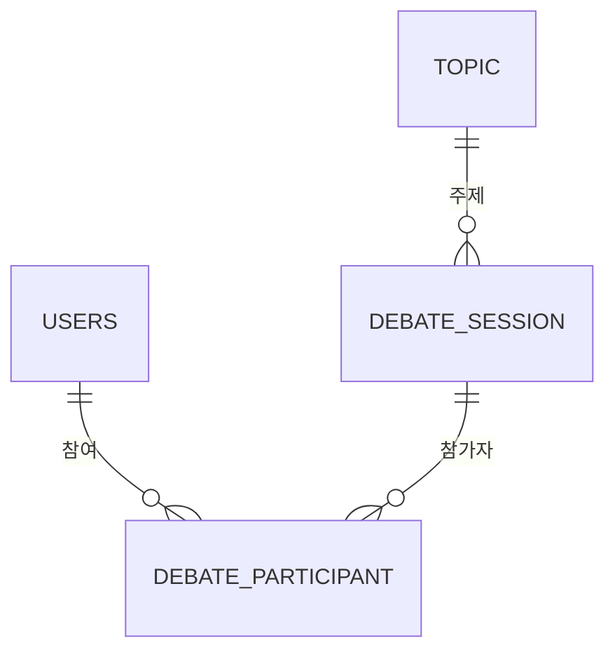
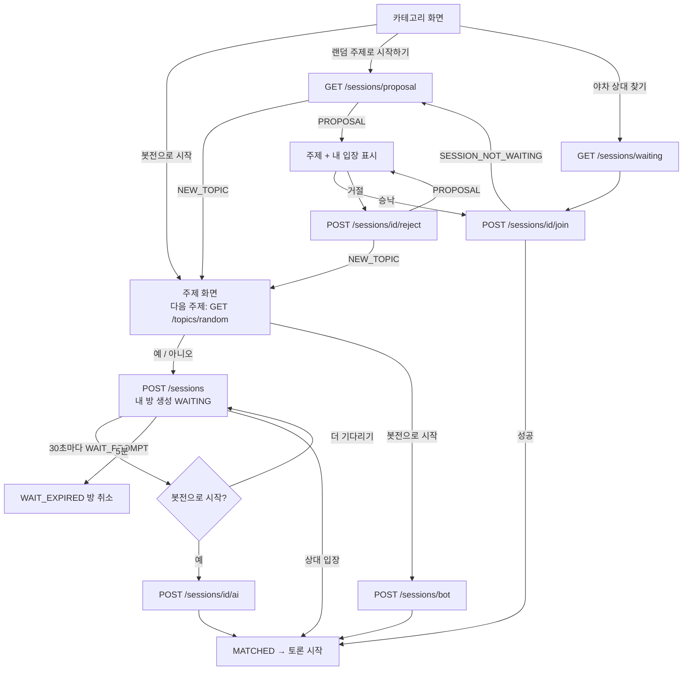

# 야차철학 — ERD & API 명세서 (Final v2)

> Base URL: `https://api.{도메인}/api/v1`
> 인증: ✅ 필수 (게스트 토큰 포함) / 선택 / — 불필요
> MVP 런칭: 10/31
>
> 🔶 **범위 변경 (PVP 우선)**
> - **사람 대 사람(HUMAN) 토론을 먼저 구현**한다.
> - 토론은 시간표(2-11)대로 진행되고, 채팅 구간은 **WebSocket(STOMP)** 으로 전송한다.
> - 실시간 투표는 **범위에서 제외**한다. (🟣 관전은 포함으로 바뀌었다)
> - 바뀐 부분은 🔶 로 표시했다. 팀 합의가 필요한 것은 **PART 5. 결정 필요**에 모았다.
>
> 🟢 **피그마 확정 개정 (10/5)** — 화면(피그마) 기준으로 진행 구조 · 매칭 · 판정을 다시 정했다.
> - 진행: **주장 작성(60초) → 주장 공개(20초) → 반론 작성(60초) → 1:1 채팅(120초)**, 총 4분 20초. 채팅은 **한 번**이고 최종변론은 없다 (2-11).
> - 주장 · 반론은 제출하고 기다리며, 시간이 끝나면 자동 제출된다. 공개는 3초 유예 뒤 (2-4).
> - 근거 검색 · 상대 요약을 없애고 **AI 힌트 3개(20자 이내)** 로 바꿨다 (2-5).
> - 판정은 **4기준 × 25점**, 총점이 높은 쪽이 승리, 같으면 무승부. 철학자 판독 대신 **기준별 한 줄 요약** (2-6).
> - 자동 제안은 **상위 카테고리 8개를 한 바퀴** 돌고, 끝나면 새 주제로 내 방을 만든다. **자동 봇전은 없애고** 바로 봇전 시작을 추가했다 (2-3).
> - `topic` 에 하위 카테고리 · 찬성 / 반대 문구, `users` 에 철학자 유형을 추가했다 (1-2). 친구와 야차는 **구현 보류**.
> - **관전은 사용하지 않는다.** 관전 코드는 지우지 않고 설정(`spectate.enabled=false`)으로 꺼 둔다. 토론방 구독 · 상태 · 메시지 · 결과는 **참가자만** 본다 (2-4).
> - 이번에 바뀐 부분은 🟢 로 표시했다.
>
> 🟠 **비회원 권한 개정 (10/2)**
> - 비회원(게스트)은 **관전 · 게임(채팅)만** 할 수 있다. 승패 기록 · 친구 초대 · 1분 철학 등 나머지는 회원 전용이다 (2-1).
> - 비회원의 게임 결과는 전적에 반영하지 않고, 닉네임도 바꿀 수 없다.
> - 오래된 비회원 계정은 매일 정리한다 (2-1).
> - 이번에 바뀐 부분은 🟠 로 표시했다.
>
> 🔷 **매칭 플로우 개정 (9/27)**
> - 대기열 자동 매칭 → **방 기반 매칭**. 랜덤 야차(자동 제안 · 방 찾기)와 친구와 야차(초대 링크) 두 가지로 나뉜다 (2-3).
> - 대기 30초마다 봇전 전환을 제안하고, 제안을 계속 거절하면 봇전으로 자동 매칭하므로 **봇전(AI)이 MVP 로 들어온다**.
> - 주제는 카테고리 **8개**의 주제 풀에서 뽑고, 입장은 **동의 / 비동의**로 나눈다.
> - 인증은 **JWT 로 통일**됐다 (PR #15). 세션 관련 내용을 정리했다 (2-1).
> - 이번에 바뀐 부분은 🔷 로 표시했다.
>
> 🟣 **관전 · 채팅 비저장 개정 (9/27)**
> - **관전(보기만)을 포함**한다. 구독은 참가자와 관전자, 전송은 참가자만 (2-4).
> - **채팅 내용은 DB · Redis 어디에도 저장하지 않는다.** 게임 동안 **서버 메모리**에만 두고, 판정이 끝나면 버린다 (1-5).
> - DB 에 남는 게임 기록은 **참가자별 승패(WIN / LOSE / DRAW)뿐**이다. 점수 · 철학자 판독은 결과 화면에만 보여준다 (2-6).
> - **공개 페이지는 폐지**한다 (2-7).
> - 이번에 바뀐 부분은 🟣 로 표시했다.

---

# PART 1. ERD

## 1-1. 전체 관계도


```mermaid
erDiagram
    USERS ||--o{ DEBATE_PARTICIPANT : "참여"

    TOPIC ||--o{ DEBATE_SESSION : "주제"

    DEBATE_SESSION ||--o{ DEBATE_PARTICIPANT : "참가자"
```

> 🟣 `argument` · `evidence` · `debate_summary` · `debate_result` 테이블은 **제거**했다. 채팅 · 근거 · 요약 · 판정 상세는 게임 동안 서버 메모리에만 있다 (1-5).

---

## 1-2. MVP 테이블 (🟣 4개)

### users — 사용자

| 컬럼 | 타입 | 제약 | 비고 |
| --- | --- | --- | --- |
| id | BIGINT | PK |  |
| email | VARCHAR(255) | UNIQUE, NULL | 게스트는 NULL |
| password | VARCHAR(255) | NULL | 게스트는 NULL |
| nickname | VARCHAR(50) | NN |  |
| is_guest | BOOLEAN | NN |  |
| role | VARCHAR(20) | NN | `USER` / `ADMIN` |
| philosopher_type | VARCHAR(20) | NULL | 🟢 **철학자 유형** — 회원가입 때 정해진다 (가입 · 유형 결정은 다른 담당). 프로필 이미지는 프론트가 유형으로 고른다. 없으면 기본 이미지 |
| created_at | DATETIME | NN |  |
| updated_at | DATETIME | NN |  |

> 게스트도 `users` 행을 만든다. 회원 전환 시 같은 행에서 `is_guest = false` → 데이터 이관 불필요.
>
> 🟢 **철학자 유형 8개**
>
> | 값 | 이름 | 설명 |
> | --- | --- | --- |
> | `NIETZSCHE` | 니체형 | 기존의 답을 부수는 자 |
> | `KANT` | 칸트형 | 원칙을 배신하지 않는 자 |
> | `MILL` | 밀형 | 최대 행복을 계산하는 자 |
> | `SARTRE` | 사르트르형 | 선택으로 자신을 만드는 자 |
> | `EPICURUS` | 에피쿠로스형 | 평온을 지키는 자 |
> | `EPICTETUS` | 에픽테토스형 | 흔들리지 않는 자 |
> | `HOBBES` | 홉스형 | 질서를 세우는 자 |
> | `ROUSSEAU` | 루소형 | 사회를 의심하는 자 |
>
> 유형이 없는 사용자(게스트 등)는 기본 이미지, 봇은 봇 전용 이미지를 쓴다.

### topic — 🔷 주제 풀 (구 `daily_topic`)

| 컬럼 | 타입 | 제약 | 비고 |
| --- | --- | --- | --- |
| id | BIGINT | PK |  |
| category | VARCHAR(20) | NN | 🔷 **8개로 확정** — `HUMAN`(인간) / `RELATIONSHIP`(관계) / `ETHICS`(윤리) / `SOCIETY`(사회) / `LIFE_AND_DEATH`(삶과 죽음) / 🟢 `TECH_AND_FUTURE`(기술과 미래) / `MONEY_AND_SUCCESS`(돈과 성공) / 🟢 `TRUTH_AND_BELIEF`(진실과 믿음) |
| subcategory | VARCHAR(30) | NN | 🟢 **하위 카테고리** (아래 표). 상위 카테고리는 하위 카테고리로 정해진다 |
| statement | TEXT | NN | 🔷 동의 / 비동의로 답하는 **명제**. 🟢 주제 화면 · 대기 목록에 뜨는 질문형 문장 (예: "지구가 평평하다는 말, 진실인가?") |
| agree_text | VARCHAR(100) | NN | 🟢 찬성(예) 입장 문구 (예: "지구는 평평하다!") |
| disagree_text | VARCHAR(100) | NN | 🟢 반대(아니오) 입장 문구 (예: "지구는 평평하지 않다!") |
| is_active | BOOLEAN | NN | 🔷 랜덤 추첨 대상 여부. 내린 주제는 `false` |
| created_at | DATETIME | NN |  |
| updated_at | DATETIME | NN | 🟢 다른 테이블과 같은 생성 · 수정 시각 (`BaseTimeEntity`) |

> 🔷 하루 한 주제(`topic_date`)가 아니라 **카테고리별 주제 풀**이다. 랜덤 야차 · 봇전 모두 여기서 뽑는다.
> 🟢 찬성 / 반대 문구는 작성 화면의 "내 입장", 주장 공개 · 채팅 말풍선, 채팅 상단의 "찬성 문구 VS 반대 문구" 에 쓴다.
> 🟢 카테고리 이름이 바뀌었다: 미래기술(`FUTURE_TECH`) → **기술과 미래**(`TECH_AND_FUTURE`), 진실과 거짓(`TRUTH_AND_LIE`) → **진실과 믿음**(`TRUTH_AND_BELIEF`). `debate_session.category` 에 옛 값이 있으면 함께 고친다.
> 오늘의 야차판(`/topics/today`)을 유지할지는 결정 필요 (PART 5).

🟢 **하위 카테고리**

| 카테고리 | 하위 카테고리 (`subcategory` 값) |
| --- | --- |
| 인간 `HUMAN` | 인간 본성 `HUMAN_NATURE` · 욕망 `DESIRE` · 행복 `HAPPINESS` · 자아 `SELF` · 자유의지 `FREE_WILL` |
| 관계 `RELATIONSHIP` | 사랑 `LOVE` · 연애 `DATING` · 우정 `FRIENDSHIP` · 가족 `FAMILY` · 배신 `BETRAYAL` · 신뢰 `TRUST` |
| 윤리 `ETHICS` | 선악 `GOOD_AND_EVIL` · 거짓말 `LYING` · 희생 `SACRIFICE` · 책임 `RESPONSIBILITY` · 옳고 그름 `RIGHT_AND_WRONG` |
| 사회 `SOCIETY` | 공정 `FAIRNESS` · 차별 `DISCRIMINATION` · 규칙 `RULES` · 범죄 `CRIME` · 개인과 공동체 `INDIVIDUAL_AND_COMMUNITY` |
| 삶과 죽음 `LIFE_AND_DEATH` | 죽음 `DEATH` · 영생 `IMMORTALITY` · 삶의 의미 `MEANING_OF_LIFE` · 안락사 `EUTHANASIA` · 존재 `EXISTENCE` |
| 기술과 미래 `TECH_AND_FUTURE` | AI `AI` · 로봇 `ROBOT` · 가상현실 `VIRTUAL_REALITY` · 복제 `CLONING` · 인간과 기술 `HUMAN_AND_TECH` |
| 돈과 성공 `MONEY_AND_SUCCESS` | 부 `WEALTH` · 노동 `LABOR` · 성공 `SUCCESS` · 능력주의 `MERITOCRACY` · 행복과 돈 `HAPPINESS_AND_MONEY` |
| 진실과 믿음 `TRUTH_AND_BELIEF` | 진실 `TRUTH` · 거짓 `FALSEHOOD` · 종교 `RELIGION` · 지식 `KNOWLEDGE` · 현실 `REALITY` · 믿음 `BELIEF` |

> 🟢 **주제 뽑기**: 고른 카테고리 안에서 **활성 주제가 있는 하위 카테고리를 랜덤으로 고르고**, 그 안에서 주제를 랜덤으로 뽑는다. 하위 카테고리마다 주제 수가 달라도 고르게 나온다. 다시 뽑기의 `exclude` 주제는 **하위 카테고리를 고르기 전에** 뺀다. 그 주제가 하위 카테고리의 유일한 주제면 그 하위 카테고리는 후보에서 빠지고, 카테고리 전체에 뽑을 주제가 없을 때만 `TOPIC_NOT_FOUND` 다.

### debate_session — 토론 세션

| 컬럼 | 타입 | 제약 | 비고 |
| --- | --- | --- | --- |
| id | BIGINT | PK |  |
| topic_id | BIGINT | FK, NULL | → topic. 🔷 **랜덤 방은 생성 시 채운다.** 친구 방만 친구가 입장할 때까지 NULL |
| category | VARCHAR(20) | NN | 🔷 방을 만들 때 고른 카테고리. 자동 제안 · 방 찾기 · 봇전 주제 추첨의 기준 |
| room_type | VARCHAR(20) | NN | 🔷 `RANDOM`(랜덤 야차) / `FRIEND`(친구와 야차 — 🟢 구현 보류) |
| invite_code | VARCHAR(32) | UNIQUE, NULL | 🔷 친구 방 초대 코드. `RANDOM` 은 NULL. 만료는 `created_at + 10분` |
| mode | VARCHAR(20) | NN | `AI` / `HUMAN` — 🔷 **둘 다 MVP**. 대기 중 AI 전환이면 `AI` 로 바뀌고, 🟢 바로 봇전은 처음부터 `AI` 다 |
| evidence_mode | VARCHAR(20) | NN | `NONE`(키배 ONLY) / `ENABLED`(근거 무기) — 🔶 **유지 여부 결정 필요** (PART 5) |
| status | VARCHAR(20) | NN | `WAITING`(대기) / `IN_PROGRESS` / `FINISHED` / 🔷 `CANCELLED`(대기 취소 · 🟢 5분 상한 도달 · 초대 만료) |
| started_at | DATETIME | NULL | 🔶 **매칭 성사 시각.** 현재 구간은 `now - started_at` 으로 계산 |
| finish_reason | VARCHAR(20) | NULL | 🔶 `COMPLETED`(정상 종료) / `FORFEIT`(🟢 나가기 · 연결 끊김 몰수패) / 🟣 `ABORTED`(서버 재시작 등으로 게임 무효) |
| origin_session_id | BIGINT | FK, NULL | 도전장용 — 컬럼만 확보 |
| created_at | DATETIME | NN | 🔷 **대기 타이머의 기준.** 30초 팝업 · 5분 상한 · 초대 10분 만료를 모두 여기서 계산 |
| ended_at | DATETIME | NULL |  |

### debate_participant — 참가자

| 컬럼 | 타입 | 제약 | 비고 |
| --- | --- | --- | --- |
| id | BIGINT | PK |  |
| session_id | BIGINT | FK, NN |  |
| user_id | BIGINT | FK, NULL | AI는 NULL. 🟠 정리된 비회원 계정, 승격 전 게스트 때 끝난 경기의 참가 기록도 NULL |
| participant_type | VARCHAR(20) | NN | `USER` / `AI` |
| role | VARCHAR(20) | NN | `INITIATOR` / `OPPONENT` — 🔷 방을 만든 사람(방장)이 INITIATOR |
| stance | VARCHAR(10) | NULL | 🔷 `AGREE` / `DISAGREE` (구 `selected_option`). 배정 규칙은 아래 |
| joined_at | DATETIME | NN |  |
| disconnected_at | DATETIME | NULL | 🔶 연결이 끊긴 시각. 재접속하면 NULL 로 되돌린다 (이탈 유예 판단용) |
| result | VARCHAR(10) | NULL | 🟣 `WIN` / `LOSE` / `DRAW`. 판정 전 · `ABORTED` 면 NULL. **DB 에 남는 게임 결과는 이것뿐**이다 |

> 🔷 **`stance` 배정 규칙**
>
> | 경우 | 방장 (INITIATOR) | 상대 (OPPONENT) |
> | --- | --- | --- |
> | 랜덤 야차 | 방을 만들 때 **직접 선택** | 방장의 **반대** (자동 제안 · 방 찾기 모두) |
> | 친구와 야차 (🟢 보류) | 친구 입장 시 **서버가 무작위** | 방장의 반대 |
> | 대기 중 AI 전환 | 이미 선택한 값 유지 | AI 참가자가 반대 |
> | 🟢 바로 봇전 | 주제 화면에서 **직접 선택** | AI 참가자가 반대 |
>
> 친구 방은 친구가 들어올 때까지 방장의 `stance` 가 NULL 이다. 🟢 자동 봇전은 없앴다.

---

## 1-3. 주요 인덱스

| 테이블 | 인덱스 |
| --- | --- |
| topic | 🔷 `(category, is_active)` — 카테고리 안 랜덤 추첨, 🟢 `(subcategory, is_active)` — 하위 카테고리 안 랜덤 추첨 |
| debate_session | `(topic_id, created_at)`, 🔷 `(room_type, status, category, created_at)` — 대기열 조회 (자동 제안 · 방 찾기가 오래된 순서로 읽는다), 🟣 같은 인덱스로 관전 목록(`IN_PROGRESS`)도 조회, 🔷 `UNIQUE(invite_code)` |
| debate_participant | `(user_id)` — 전투 기록, `(session_id)` |

---

## 1-4. ERD 수정 필요 (지금)

| 대상 | 변경 |
| --- | --- |
| `argument` | `crentent` → `content` 오타 수정 |
| `debate_result` | `session_id` UNIQUE → `UNIQUE(session_id, participant_id)` |
| `debate_session` | `is_public`, `evidence_mode` 추가 |
| `daily_topic` | `category` 추가 |
| `users` | `role`, `password` 추가 |
| 🔶 `argument` | `turn_no` → `seq_no`, `UNIQUE(session_id, seq_no)`, `FINAL` 100자 제한 |
| 🔶 `debate_session` | `started_at`, `finish_reason` 추가 |
| 🔶 `debate_participant` | `disconnected_at` 추가 |
| 🔶 `evidence` | 사용자 검색 → 참가자별 AI 제공 3건 |
| 🔶 `debate_summary` | 신규 테이블 |
| 🔷 `daily_topic` → `topic` | 하루 한 주제 → 카테고리별 주제 풀. `question` + `option_a/b` → `statement`, `is_active` 추가 |
| 🔷 `debate_session` | `category`, `room_type`, `invite_code` 추가, `status` 에 `CANCELLED` 추가 |
| 🔷 `debate_participant` | `selected_option`(A/B) → `stance`(AGREE/DISAGREE) |
| 🟣 `argument` · `evidence` · `debate_summary` · `debate_result` | **테이블 제거** — 게임 중 서버 메모리로 대체 (1-5). 위 표의 해당 행은 무효 |
| 🟣 `debate_session` | `is_public` 제거 (공개 페이지 폐지), `finish_reason` 에 `ABORTED` 추가 |
| 🟣 `debate_participant` | `result`(WIN/LOSE/DRAW) 추가 |
| 🟢 `topic` | `subcategory`, `agree_text`, `disagree_text` 추가. 카테고리 값 `FUTURE_TECH` → `TECH_AND_FUTURE`, `TRUTH_AND_LIE` → `TRUTH_AND_BELIEF` |
| 🟢 `users` | `philosopher_type` 추가 (가입 담당) |

---

## 1-5. 🟣 게임 중 데이터 — 서버 메모리

채팅 내용은 **DB · Redis · 로그 어디에도 남기지 않는다.** 게임 하나마다 서버 메모리에 게임 상태 객체를 두고, 끝나면 버린다.

| 데이터 | 내용 | 생기는 시점 | 버리는 시점 |
| --- | --- | --- | --- |
| 채팅 메시지 | `seqNo`, 보낸 참가자, 구간, 내용, 수신 시각 | 채팅 수신, 🟢 주장 · 반론 공개 | 판정 완료 (`FORFEIT` · `ABORTED` 는 종료 즉시) |
| 🟢 작성 중인 글 | 참가자별 · 작성 구간(`PREP` 주장 · `REBUTTAL` 반론)별 1건, 내용, 제출 시각. 공개 전에는 본인만 | 제출 | 게임 종료 (공개된 내용은 채팅 메시지로 남음) |
| 🟢 힌트 | 참가자별 3개 (20자 이내 문장) | 매칭 성사 직후 | 게임 종료 |
| 판정 상세 | 🟢 4기준 점수 · 총점 · 기준별 한 줄 요약 | 판정 완료 | **결과 화면 보관 시간** 경과 (🟢 새로고침 대비로 짧게, 제안 10분) |

**규칙**

- 세션 id → 게임 상태 객체의 맵으로 관리한다. 같은 게임의 요청은 **게임 객체 단위로 잠가** 직렬화한다 (`seqNo` 채번, 🟢 공개 순서, 참가자별 채팅 건수).
- `seqNo` 는 게임 객체 안의 카운터로 **서버가 채번**한다.
- **채팅 내용을 로그에 찍지 않는다.** 예외 로그에도 메시지 본문을 넣지 않는다.
- 판정 · 🟢 힌트 · 봇 발언을 위해 대화는 **외부 LLM API 로는 전송된다.** 저장하지 않는다는 것은 우리 서버 기준이다.
- **서버가 재시작되면 메모리가 사라진다.** 기동 시 `IN_PROGRESS` 세션을 모두 `FINISHED` + `finish_reason = ABORTED` 로 정리하고 `result` 는 NULL 로 둔다 (게임 무효).
- **서버 1대 전제**다 (simple broker 와 같은 전제). 여러 대로 늘리면 게임을 한 서버에 고정하거나 공유 저장소가 필요하므로 그때 다시 정한다.

---

# PART 2. API 명세 (MVP)

## 2-1. 인증 · 사용자

🔷 **JWT 로 통일한다** (PR #15 에서 확정 · 구현). 세션(HttpSession)은 쓰지 않는다.

| | 액세스 토큰 | 리프레시 토큰 |
| --- | --- | --- |
| 수명 | 10분 | 14일 |
| 보관 (프론트) | 메모리 / LocalStorage | HttpOnly 쿠키 (`path=/api/v1/auth`) |
| 전송 | `Authorization: Bearer` | 쿠키 자동 전송 |
| 서버 저장 | 안 함 (무상태) | Redis |

| Method | Path | 설명 | 인증 |
| --- | --- | --- | --- |
| POST | `/auth/signup` | 회원가입 + 토큰 발급 | — |
| POST | `/auth/login` | 로그인 (토큰 발급) | — |
| POST | `/auth/token` | 🔷 `/auth/login` 과 같은 동작. 프론트가 쓰는 쪽을 정하면 나머지는 정리 | — |
| POST | `/auth/token/refresh` | 토큰 재발급. 쿠키의 리프레시 토큰으로 인증 | 쿠키 |
| POST | `/auth/logout` | 로그아웃 (서버의 리프레시 토큰 삭제 + 쿠키 만료) | ✅ |
| POST | `/auth/guest` | 게스트 생성 + 토큰 발급 | — |
| POST | `/auth/upgrade` | 게스트 → 회원 승격 (같은 계정 유지, 토큰 재발급) | ✅ |
| GET | `/users/me` | 내 정보 · 누적 통계 | ✅ |
| PATCH | `/users/me` | 닉네임 변경 — 🟠 회원 전용 | ✅ (회원) |

**로그인 정책 (MVP)**

| 기능 | 게스트 | 회원 |
| --- | --- | --- |
| 토론 (사람 대 사람 · 봇전) | ✅ | ✅ |
| 🟠 관전 (🟢 미사용) | — | — |
| 공개 페이지 열람 | ✅ | ✅ |
| 전투 기록 조회 | ❌ | ✅ |
| 🟠 승패 기록 (전적 반영) | ❌ | ✅ |
| 🟠 친구 초대 (초대 코드 생성) | ❌ | ✅ |
| 🟠 친구 초대 링크로 참여 (구현 예정) | ✅ | ✅ |
| 🟠 1분 철학 | ❌ | ✅ |
| 🟠 닉네임 · 비밀번호 변경 | ❌ | ✅ |

🟠 **비회원 권한 (10/2)**

- 게스트 토큰에는 `GUEST` 역할이 실린다. 서버는 **게스트가 쓸 수 있는 경로만 열어 두고 나머지는 모두 회원 전용**으로 막는다. 그래서 새 기능은 따로 막지 않아도 회원 전용이 된다.

  | 게스트도 쓰는 경로 | 용도 |
  | --- | --- |
  | `/auth/logout` · `/auth/upgrade` | 로그아웃 · 회원 승격 |
  | `/sessions/**` | 게임 (방 · 상태 · 메시지 · 주장 등). 🟢 관전은 사용하지 않는다 |
  | `GET /users/me` · `GET /topics/**` | 내 정보 · 주제 조회 |

- **게임 · 관전용 경로를 `/sessions/**` 밖에 새로 만들면** `SecurityConfig` 의 게스트 경로 목록에 추가해야 한다.
- `GET /sessions/me`(전투 기록)는 `/sessions/**` 아래지만 회원 전용이다.
- **친구 초대는 생성만 회원 전용**이고, 초대 링크로 참여(`POST /sessions/invite/{code}/join`)는 비회원도 할 수 있다. 초대받은 사람이 가입 유도 효과가 가장 커서, 먼저 한 판 해 보게 한다.
  - 초대 API 는 **아직 구현 전**이다. 경로가 `/sessions/**` 아래라 구현되면 별도 설정 없이 비회원도 쓸 수 있다.
- 친구 방 생성은 랜덤 방 생성과 경로(`POST /sessions`)가 같아서 경로로는 막을 수 없다. 초대 기능에서 서비스가 회원인지 확인한다 (게스트면 `GUEST_NOT_ALLOWED`).
- 게스트가 회원 전용 기능을 부르면 **403 `GUEST_NOT_ALLOWED`** 를 받는다. 다른 403(`FORBIDDEN` 등)과 구분되므로 프론트는 이 코드로 가입 안내를 띄운다.
- 비회원의 게임 결과는 전적에 반영하지 않는다. 회원 대 비회원 게임에서 **회원 쪽 결과는 정상 반영**한다.
- 비회원이 회원으로 **승격하면 게스트 때 끝난 경기의 참가 기록에서 연결을 끊는다** (`user_id` → NULL). 같은 계정을 그대로 쓰므로, 끊지 않으면 승격 뒤 회원 전적에 섞인다. 대기 · 진행 중인 경기는 그대로 둔다 (지금 하는 게임은 이어지고, 끝나면 회원 기록으로 남는다).
- `/auth/upgrade` 는 새 토큰을 주므로 승격 직후 바로 회원 기능을 쓸 수 있다. **소셜 로그인으로의 승격은 만들지 않는다.** 비회원 계정에는 이어 갈 데이터가 없어서, 비회원이 소셜 로그인하면 새 회원으로 시작하고 남은 비회원 계정은 정리 작업이 지운다.
- **비회원 계정 정리**: 만든 지 14일이 지났고 리프레시 토큰이 없는 비회원 계정을 매일 새벽 4시에 지운다. 비회원은 비밀번호가 없어서 리프레시 토큰이 없으면 다시 들어올 방법이 없다. 참가 기록은 남고 `user_id` 만 비워진다.

**확정 사항**

- [x] 🔷 **JWT 통일**: 모든 클라이언트가 같은 방식을 쓴다. 인증에 성공하면 `AuthUser`(id, role)를 `SecurityContext` 에 넣고, 컨트롤러 · 서비스는 이것만 본다.
- [x] 🔷 **재발급**: 재발급할 때마다 리프레시 토큰을 새로 바꾸고 이전 토큰은 즉시 무효가 된다. 프론트는 401 을 받은 요청들의 **재발급 호출을 하나로 묶어야** 한다 (따로 호출하면 늦은 쪽이 이미 사용된 토큰으로 판정돼 로그아웃된다).
- [x] 🔷 **로그아웃 범위**: 리프레시 토큰은 서버에서 지운다. 이미 발급된 액세스 토큰은 막지 못하고 최대 10분 뒤 만료된다.
- [x] 🔷 **CSRF**: 세션을 쓰지 않으므로 CSRF 토큰은 끈다. 쿠키는 리프레시 토큰에만 쓰고 경로를 `/api/v1/auth` 로 좁혔다. `SameSite` 는 설정값(기본 `Lax`)이다.
- [x] 🔷 **WebSocket 사용자 식별**: `/ws` 핸드셰이크는 열어 두고, **STOMP CONNECT 프레임의 `Authorization: Bearer` 헤더**로 식별한다. 참가자 검증은 SUBSCRIBE 때 한다 (2-12).
- [x] 🔷 **비로그인 사용자**: 토론 API 는 모두 토큰이 필요하다. 비로그인 사용자는 먼저 `/auth/guest` 로 토큰을 받는다. 친구 초대 링크로 들어온 비로그인 사용자도 같다.

🟢 **비밀번호 찾기 — 이메일 인증번호 (10/5)** — 이메일이 로그인 아이디라 아이디 찾기는 따로 없고, 비밀번호 재설정만 한다. 메일 링크 대신 **인증번호 입력** 방식이다 (와이어프레임: 아이디 입력 → 인증번호 → 인증 완료 → 비밀번호 재설정).

| Method | Path | 설명 | 인증 |
| --- | --- | --- | --- |
| POST | `/auth/password/reset-request` | ① `{ email }` → 메일로 6자리 인증번호. 가입 여부와 관계없이 항상 200 | — |
| POST | `/auth/password/verify` | ② `{ email, code }` → `{ resetToken }` | — |
| POST | `/auth/password/reset` | ③ `{ token: resetToken, newPassword }` → 비밀번호 저장 · 모든 기기 로그아웃 | — |

| 항목 | 값 |
| --- | --- |
| 인증번호 | 6자리 숫자 (`SecureRandom`, 앞자리 0 포함). 이메일당 하나, 새로 요청하면 이전 번호와 틀린 횟수는 버린다 |
| 유효시간 | 3분 (화면 타이머) |
| 틀릴 수 있는 횟수 | 5번. 그다음은 맞는 번호여도 만료로 처리하고 다시 요청해야 한다 |
| 재요청 | 같은 이메일은 1분에 한 번. 제한에 걸려도 200 이고 이전 인증번호가 그대로 유효 |
| `resetToken` | 10분, 1회용 |

- **가입 여부를 드러내지 않는다.** ①은 항상 200 이고, 가입 안 된 이메일 · 소셜 전용 계정에도 인증번호를 똑같이 저장해 둔다 (메일만 보내지 않는다). 그래서 ②의 "틀림" · "만료" 응답이 가입된 이메일과 같다.
- 소셜 전용 계정에는 인증번호 대신 "소셜 로그인을 이용하세요" 안내 메일이 간다.
- 확인 · 틀린 횟수 증가 · 삭제는 Redis 에서 한 번에 처리한다. 동시에 여러 번 보내 5번 제한을 넘기거나, 같은 번호로 토큰을 두 번 받을 수 없다.
- 에러: ② `INVALID_RESET_CODE`(400, 틀림 — 다시 입력) · `RESET_CODE_EXPIRED`(400, 만료 · 5번 틀림 · 요청 안 함 — 다시 요청), ③ `INVALID_RESET_TOKEN`(401, 처음부터 다시). 형식이 틀린 인증번호는 `VALIDATION_FAILED` 이고 횟수에 들어가지 않는다.
- 메일 링크가 없어져 프론트의 `/reset-password?token=` 페이지와 서버 설정 `FRONTEND_BASE_URL` 은 쓰지 않는다.

---

## 2-2. 주제 · 카테고리

| Method | Path | 설명 | 인증 |
| --- | --- | --- | --- |
| GET | `/topics/random?category=&exclude=` | 🔷 카테고리 안에서 랜덤 주제 1개. **다시 뽑기**(🟢 "다음 주제로 넘어가기")는 방금 본 주제 id 를 `exclude` 로 넘긴다. 🟢 `exclude` 를 뺀 뒤 주제가 남은 하위 카테고리를 먼저 랜덤으로 고른다 (1-2). 카테고리 전체에 뽑을 주제가 없을 때만 `TOPIC_NOT_FOUND`(404), 카테고리 값이 잘못되면 `BINDING_ERROR`(400) | ✅ (게스트 가능) |
| GET | `/topics/today` | 오늘의 야차판 — 🔷 **유지 여부 결정 필요** (PART 5) | — |
| GET | `/topics` | 주제 목록 (카테고리 · 페이징) — 🟢 **미구현** (필요해지면 만든다) | — |
| GET | `/topics/{id}` | 주제 상세 — 🟢 **미구현** (필요해지면 만든다) | — |
| GET | `/categories` | 카테고리 목록 — 🔷 **8개**, 🟢 하위 카테고리 포함 | — |

🟢 **주제 응답**

```json
{ "id": 12, "category": "TRUTH_AND_BELIEF", "subcategory": "REALITY",
  "statement": "지구가 평평하다는 말, 진실인가?", "agreeText": "지구는 평평하다!", "disagreeText": "지구는 평평하지 않다!" }
```

🟢 **카테고리 목록 응답** (`GET /categories`) — 카테고리 8개를 자동 제안 순환 순서로, `code` 는 요청에 쓰는 값 · `name` 은 화면 이름

```json
[ { "code": "HUMAN", "name": "인간",
    "subcategories": [ { "code": "HUMAN_NATURE", "name": "인간 본성" }, { "code": "DESIRE", "name": "욕망" } ] } ]
```

---

## 2-3. 토론 세션 · 매칭 (🔷 방 기반)

🔷 매칭은 **방**으로 한다. 사람을 기다리는 방(`WAITING`)이 곧 대기열이다.

| 종류 | `room_type` | 주제 · 입장 | 대기 중 노출 |
| --- | --- | --- | --- |
| 랜덤 야차 | `RANDOM` | 방장이 주제를 받고 동의 / 비동의를 고른다 | 자동 제안 · 방 찾기 |
| 🟢 봇전 | `RANDOM` + `mode = AI` | 사용자가 주제 · 입장을 고르고, 봇이 반대 | 노출 안 됨 (대기 없음) |
| 친구와 야차 (🟢 **구현 보류**) | `FRIEND` | 친구 입장 시 서버가 주제 · 입장을 무작위 배정 | 초대 링크로만 |

### 2-3-1. API

| Method | Path | 설명 | 인증 |
| --- | --- | --- | --- |
| GET | `/sessions/proposal?category=` | 🔷 **자동 제안** — "랜덤 주제로 시작하기". 🟢 카테고리 순환으로 대기 방 1개(`PROPOSAL`), 한 바퀴 돌면 새 주제(`NEW_TOPIC`) | ✅ |
| POST | `/sessions/{id}/join` | 🔷 **입장** — 자동 제안 승낙 · 방 찾기 입장 공통 | ✅ |
| POST | `/sessions/{id}/reject` | 🔷 **제안 거절** — 🟢 다음 카테고리의 제안 또는 새 주제 | ✅ |
| GET | `/sessions/waiting?category=&page=` | 🔷 **방 찾기** — "야차 상대 찾기" 대기 방 목록 (오래된 순) | ✅ |
| POST | `/sessions` | 🔷 **방 생성** — 랜덤 방 (친구 방은 🟢 보류) | ✅ |
| POST | `/sessions/bot` | 🟢 **바로 봇전** — 대기 방 없이 봇전을 만들고 바로 시작 | ✅ |
| POST | `/sessions/invite/{code}/join` | 🔷 **초대 코드로 입장** (친구 방, 🟢 보류) | ✅ |
| POST | `/sessions/{id}/ai` | 🔷 **AI 대결로 전환** — 방장만, `WAITING` 일 때만 | ✅ |
| DELETE | `/sessions/{id}` | 대기 취소 — 방장만, `WAITING` 일 때만 | ✅ |
| POST | `/sessions/{id}/leave` | 🟢 **게임 중 나가기** — 참가자만, `IN_PROGRESS` 일 때. 바로 몰수패 (2-11) | ✅ |
| GET | `/sessions/{id}/state` | 🔶 현재 구간 · 남은 시간 · `serverNow` (재접속 · 새로고침용). 세션 상세(방 정보 · 참가자 · 🟢 주제 찬성 / 반대 문구 · 참가자 철학자 유형)와 🟢 지금 작성 구간의 제출 여부(`participants[].submitted` — 작성 구간이 아니면 `null`)도 여기서 준다. 승패 · 사용자 id 는 넣지 않는다 | ✅ |
| GET | ~~`/sessions/live?category=&page=`~~ | 🟣 관전 목록 — 🟢 **관전 미사용으로 구현하지 않는다** | — |
| GET | `/sessions/me` | 전투 기록 — 🟣 주제 · 상대 · 날짜 · **승패**만 (대화 내용 없음) | ✅ (회원) |

> 🔷 모든 세션 API 는 토큰이 필요하다. 비회원은 **`/auth/guest` 로 토큰을 받은 뒤** 호출한다.
> 🔷 봇전도 HUMAN 과 같은 시간표(2-11)로 진행한다. 기존 봇전 전용 `POST /sessions/{id}/finish` 는 제거한다. 🟢 봇의 작성 · 채팅 규칙은 2-4 에 있다.

**방 생성 요청**

```json
{ "roomType": "RANDOM", "topicId": 12, "stance": "AGREE" }
{ "roomType": "FRIEND", "category": "ETHICS" }
```

🟢 **바로 봇전 요청** (`POST /sessions/bot`) — 응답은 `{ "sessionId": 40 }` 이고 바로 `IN_PROGRESS` 다.

```json
{ "topicId": 12, "stance": "AGREE" }
```

친구 방 응답에는 초대 코드와 만료 시각이 들어간다.

```json
{ "sessionId": 31, "inviteCode": "k3Xp9aQ2", "expiresAt": "2026-10-31T12:10:00+09:00" }
```

**제안 · 거절 응답**

```json
{ "result": "PROPOSAL", "sessionId": 31, "topic": { "id": 12, "statement": "...", "agreeText": "...", "disagreeText": "..." }, "myStance": "DISAGREE" }
{ "result": "NEW_TOPIC", "topic": { "id": 15, "statement": "...", "agreeText": "...", "disagreeText": "..." } }
```

- `PROPOSAL` — 이 방을 보여준다. `myStance` 는 방장의 반대다.
- 🟢 `NEW_TOPIC` — 카테고리 8개를 한 바퀴 돌았다 (또는 대기 방이 하나도 없다). **고른 카테고리**에서 뽑은 새 주제다. 프론트는 주제 화면(예 / 아니오, 다음 주제로 넘어가기)으로 넘어가 내 방을 만들거나 바로 봇전을 시작한다.
- 🟢 `EMPTY` · `BOT_MATCHED` 는 없앴다.

🟢 **방 찾기 응답 (카드 한 장)** — 방장 프로필 · 방 주제 · 찾는 입장

```json
{ "sessionId": 31, "host": { "nickname": "...", "philosopherType": "KANT" },
  "topic": { "id": 12, "statement": "..." }, "wantedStance": "DISAGREE" }
```

- `wantedStance` 는 방장의 반대다. 프론트는 "반대입장인 사람을 찾아요!" / "찬성입장인 사람을 찾아요!" 를 띄운다.

### 2-3-2. 랜덤 야차 흐름


```mermaid
flowchart TD
    A[카테고리 화면] -- 봇전으로 시작 --> T
    A -- 랜덤 주제로 시작하기 --> B[GET /sessions/proposal]
    A -- 야차 상대 찾기 --> W[GET /sessions/waiting] --> J
    B -- NEW_TOPIC --> T["주제 화면<br/>다음 주제: GET /topics/random"]
    T -- 예 / 아니오 --> E["POST /sessions<br/>내 방 생성 WAITING"]
    T -- 봇전으로 시작 --> L[POST /sessions/bot]
    E -- "30초마다 WAIT_PROMPT" --> F{봇전으로 시작?}
    F -- 예 --> G[POST /sessions/id/ai]
    F -- 더 기다리기 --> E
    E -- 5분 --> X[WAIT_EXPIRED 방 취소]
    E -- 상대 입장 --> H[MATCHED → 토론 시작]
    B -- PROPOSAL --> I[주제 + 내 입장 표시]
    I -- 승낙 --> J[POST /sessions/id/join]
    J -- 성공 --> H
    J -- SESSION_NOT_WAITING --> B
    I -- 거절 --> K[POST /sessions/id/reject]
    K -- PROPOSAL --> I
    K -- NEW_TOPIC --> T
    L --> H
    G --> H
```

🟢 **"봇전으로 시작하시겠습니까?"** 가 뜨는 곳은 세 군데다.

| 언제 | 봇전을 고르면 | API |
| --- | --- | --- |
| 카테고리 화면에 들어오자마자 | 주제 화면에서 주제 · 예 / 아니오를 고른 뒤 바로 봇전 | `POST /sessions/bot` |
| 자동 제안이 한 바퀴 끝났을 때 (`NEW_TOPIC`) | 새 주제 화면에서 내 방 대신 바로 봇전 | `POST /sessions/bot` |
| 내 방에서 기다릴 때 (`WAIT_PROMPT`) | 기다리던 방을 봇전으로 전환 | `POST /sessions/{id}/ai` |

**방장 (대기 방이 없어서 방을 만든 사람)**

- 주제는 고른 카테고리 안에서 랜덤으로 받는다. **다시 뽑기**를 할 수 있다. 다시 뽑기는 방 생성 전 단계라 서버 상태가 없다.
- 방을 만들면 `WAITING` 이 되고 자동 제안 · 방 찾기에 노출된다.
- 서버가 `created_at` 기준 **30초마다** `WAIT_PROMPT` 를 보낸다. 프론트는 🟢 "봇전으로 시작하시겠습니까?" [봇전] / [더 기다리기] 팝업을 띄운다.
  - 더 기다리기 — 서버 호출 없음. 방은 그대로 노출된다.
  - 대기 화면에는 광고를 넣는다. 광고 방식(Google Ad Manager 등) · 화면 크기는 프론트가 정하고, 백엔드 작업은 없는 것으로 본다.
  - 봇전 — `POST /sessions/{id}/ai`. 즉시 대기열에서 빠지고 다른 사람은 입장할 수 없다.
- **대기 상한 5분.** 🟢 5분이 되면 **방을 취소**(`CANCELLED`)하고 `WAIT_EXPIRED` 를 보낸다.
- 상대가 들어오면 **방장은 승낙 절차 없이 자동 수락**된다.
- 30초 타이머는 **방장에게만** 있다. 제안을 받는 사람의 종료 조건은 아래 순환 규칙이다.

**자동 제안 — 🟢 카테고리 순환**

- **상위 카테고리 8개를 고른 카테고리부터 순서대로** 돈다: 인간 → 관계 → 윤리 → 사회 → 삶과 죽음 → 기술과 미래 → 돈과 성공 → 진실과 믿음 → (처음으로). 예: 기술과 미래를 고르면 기술과 미래 → 돈과 성공 → 진실과 믿음 → 인간 → … → 삶과 죽음.
- 카테고리마다 그 카테고리의 `RANDOM` · `HUMAN` · `WAITING` 방 중 **가장 오래된(`created_at`) 방 1개**를 제안한다. 자기 방은 빼고, 대기 방이 없는 카테고리는 건너뛴다.
- **승낙** → `POST /sessions/{id}/join`. 방장의 반대 입장으로 들어가 바로 시작한다. 제안된 방의 카테고리가 고른 카테고리와 달라도 그 방의 주제로 토론한다.
- **동시 승낙** → 먼저 성공한 사람만 입장한다. 늦은 사람은 `SESSION_NOT_WAITING` 을 받고, 프론트가 다시 제안을 요청한다. 방을 미리 잡아 두지 않는다.
- **거절** → `POST /sessions/{id}/reject`. 다음 카테고리의 방을 제안한다.
- **8개를 한 바퀴 돌면** `NEW_TOPIC` 을 돌려준다. 처음부터 모든 카테고리에 대기 방이 없으면 곧바로 `NEW_TOPIC` 이다.
- **자동 봇전은 없다.** 봇전은 사용자가 고를 때만 시작한다 (위 표).
- 순환 상태(시작 카테고리, 지금 위치)는 **사용자별로 Redis 에 짧은 TTL** 로 둔다. 매칭되거나 새로 시작(`/proposal` 다시 호출)하면 지운다.

**방 찾기**

- `GET /sessions/waiting` 은 자동 제안과 **같은 대기열**을 목록으로 보여준다. 입장은 `POST /sessions/{id}/join` 으로 같다.
- 🟢 관전은 사용하지 않는다 (2-4).

### 2-3-3. 친구와 야차 흐름 (🟢 구현 보류)

> 🟢 친구 방은 **구현을 보류**한다. 아래는 보류 전 설계로 남겨 둔다.

1. 카테고리를 고르고 `POST /sessions { roomType: "FRIEND", category }` → 방 생성. 주제 · 입장은 아직 없다.
2. 프론트가 `inviteCode` 로 링크를 만들어 공유한다. 이 방은 자동 제안 · 방 찾기에 나오지 않고 **대기 팝업(`WAIT_PROMPT`)도 없다**.
3. 친구가 링크로 들어온다. 토큰이 없으면 먼저 `/auth/guest` 를 호출한 뒤 `POST /sessions/invite/{code}/join`.
4. 입장이 성공하면 서버가 **카테고리 안에서 주제를 랜덤**으로 정하고, **방장의 입장을 무작위**로, 친구를 반대로 배정한 뒤 시작한다.
5. **`created_at + 10분`** 까지 아무도 들어오지 않으면 `CANCELLED` 가 되고 방장에게 `INVITE_EXPIRED` 를 보낸다. 그 뒤 링크 입장은 `INVITE_EXPIRED` 에러.

### 2-3-4. 서버 규칙

- **입장 · 승낙 · AI 전환 · 취소는 모두 원자적 UPDATE** 다. `status = 'WAITING'` 조건의 UPDATE 가 **1건 갱신된 쪽만** 성공한다. 팝업에서 AI 를 누르는 순간 사람이 들어와도 한쪽만 이긴다.
- 성공하면 `started_at` 기록 → `IN_PROGRESS` → 🟢 힌트 생성 시작 → 방장에게 `MATCHED` 를 푸시한다.
- **대기 타이머**(30초 팝업 · 5분 상한 · 초대 10분)는 `created_at` 기준으로 스케줄러에 등록한다. 서버가 재시작되면 `WAITING` 방을 `created_at` 으로 다시 등록한다. 구간 스케줄러(2-11)와 같은 방식이다.
- 자기 방에는 입장할 수 없다 (`CANNOT_JOIN_OWN_ROOM`).
- 이미 대기 중이거나 진행 중인 세션이 있는 사용자는 방을 만들거나 입장할 수 없다 (`ALREADY_IN_SESSION`).
- 봇전은 사용자 참가자와 AI 참가자를 **한 트랜잭션에서 함께 만든다**. AI 의 `stance` 는 사용자의 반대다. 🟢 바로 봇전(`POST /sessions/bot`)도 `ALREADY_IN_SESSION` 검사를 똑같이 한다.
- 🟣 매칭이 성사되면 DB 상태 변경과 함께 **메모리에 게임 상태 객체**를 만든다 (1-5).

---

## 2-4. 실시간 채팅 · 🟢 주장 · 반론 (🔶 WebSocket)

**REST**

| Method | Path | 설명 | 인증 |
| --- | --- | --- | --- |
| GET | `/sessions/{id}/messages?afterSeq=N` | 메시지 조회 — 재접속 · 누락 보충 (`seqNo > N`, 오름차순). 🟣 **게임 중에만** 조회된다 (메모리). 🟢 참가자만 | ✅ |
| PUT | `/sessions/{id}/memo` | 🟢 **주장 · 반론 제출** — `PREP`(주장, **200자**) · `REBUTTAL`(반론, **250자**) 구간. 구간당 1건, 다시 제출하면 덮어쓴다. 참가자만. 요청 `{ "content": "..." }`, 응답 `{ "phase", "content", "submittedAt" }` | ✅ |
| GET | `/sessions/{id}/memo` | 🟢 **내가 제출한 주장 · 반론** (작성 구간 순). 새로고침 복구용. 참가자만, 게임 중에만 | ✅ |

**WebSocket (STOMP)**

| 방향 | 목적지 | 누가 | 설명 |
| --- | --- | --- | --- |
| SEND | `/app/sessions/{id}/chat` | 참가자 | 채팅 전송 — 🟢 `CHAT` 구간에서 반론 공개(143초) 뒤부터 |
| SUBSCRIBE | `/topic/sessions/{id}` | 참가자 (🟢 관전 미사용) | 채팅 · 🟢 공개된 주장 · 반론 · 제출 알림 · 구간 · 종료 이벤트 |
| SUBSCRIBE | `/user/queue/match` | 본인 | 🔷 방장 알림 — 매칭 성사 · 30초 팝업 · 5분 상한 · 초대 만료 |
| SUBSCRIBE | `/user/queue/errors` | 본인 | 🟣 SEND 처리 중 난 에러 (아래 형식) |

> 🟢 최종변론(`/app/sessions/{id}/final`, 100자 1회)은 **없앴다.** 채팅 마지막 30초는 "최종반론" 안내만 뜨고 똑같이 채팅이다.

**구독 권한 (SUBSCRIBE 시 검사)**

| 목적지 | 허용 |
| --- | --- |
| `/topic/sessions/{id}` | 🟢 그 세션의 **참가자만** |
| `/user/queue/**` | 본인 |
| 그 외 | 거부 |

🟢 **관전 미사용 (10/5)** — 관전 규칙("진행 중인 랜덤 사람전은 누구나 구독 · 조회, 친구 방 · 봇전은 비공개")은 코드(`SessionAccessService.isSpectatable`)에 남아 있지만 **`spectate.enabled=false`(기본값)로 꺼 둔다.** 꺼져 있으면 토론방 구독 · `/state` · `/messages` 가 모두 참가자만 되고, 참가자가 아니면 `NOT_PARTICIPANT`(REST) · `FORBIDDEN`(구독)이다. 다시 쓰려면 설정만 켜면 된다.

**서버 검증**

- SEND 는 **참가자만** 할 수 있다 (`NOT_PARTICIPANT`)
- 현재 구간이 허용하는 동작인가 (`INVALID_PHASE`) — 구간 판단은 **서버 수신 시각** 기준
- `seqNo` 는 **서버가 채번** (클라이언트 값 신뢰 금지)
- 🟢 채팅 한 건 **100자**(봇은 **50자**), 참가자 한 명당 한 게임 **200건** (`CONTENT_TOO_LONG` · `MESSAGE_LIMIT_EXCEEDED`)
- 🟣 **메모리 기록 → 브로드캐스트** 순서. 브로드캐스트한 메시지는 반드시 게임 객체에 있다 (재접속 보충이 빠지지 않도록)

🟢 **주장 · 반론 작성과 공개**

- `PREP` 에는 **주장**, `REBUTTAL` 에는 **반론**을 쓴다. 반론 화면에는 상대 주장 **원문**을 보여준다.
- **제출**: `PUT /sessions/{id}/memo` 가 곧 제출이다. 제출하면 구간이 끝날 때까지 "상대방이 아직 작성중입니다…" 화면에서 기다리고, "수정하러 가기"로 고쳐 다시 제출할 수 있다.
- **구간 전환은 고정 시간**이다. 둘 다 제출해도 일찍 넘어가지 않는다.
- **제출 알림**: 제출하면 `/topic` 으로 `ARGUMENT_SUBMITTED` 를 보낸다. **내용은 넣지 않는다.** 작성 중 내용은 공개 전까지 본인만 본다.
- **자동 제출**: 제출하지 않고 시간이 끝나면 프론트가 **타이머가 끝나는 순간 쓰던 글을 제출**한다.
- **3초 유예**: 서버는 작성 구간이 끝난 뒤 **3초 동안** 직전 구간 제출을 받는다. 그 뒤 제출은 `INVALID_PHASE`.
- **공개**: 유예가 끝나면 양쪽 글을 **`ARGUMENT` 메시지로 공개**한다 — 주장은 **63초**(`REVEAL` 화면), 반론은 **143초**(`CHAT` 화면 맨 위). `seqNo` 를 받고, `phase` 는 **작성 구간**(`PREP` = 주장, `REBUTTAL` = 반론)이다. 빈 글은 공개하지 않는다.
- 공개는 구간마다 한 번이고 **게임 락 안에서** 한다. 반론이 공개되기 전(140~143초)에는 채팅을 받지 않아 **반론이 항상 채팅보다 앞 `seqNo`** 다.
- 공개된 글은 대화 기록이라 `/messages` 와 판정 입력에 들어가고, 채팅 건수 상한에 세지 않는다.
- `GET /sessions/{id}/state` 는 지금 작성 구간의 **제출 여부**(나 · 상대)를 함께 준다. 재접속해도 "상대방이 아직 작성중" 화면을 맞출 수 있다.

🟢 **봇**

- 봇도 사람과 똑같이 주장(200자) · 반론(250자)을 쓴다.
- 채팅은 **사람이 말할 때마다 3초 뒤에 대답**하고, 한 건 **50자 이내**다. 먼저 말을 걸지 않는다.
- 사람이 3초 안에 여러 번 보내면 마지막 메시지 3초 뒤에 묶어서 한 번 대답한다 (제안).

**이벤트 형식 (`/topic/sessions/{id}`)**

```json
{ "type": "ARGUMENT_SUBMITTED", "senderId": 7, "phase": "PREP" }
{ "type": "ARGUMENT", "seqNo": 1, "senderId": 7, "phase": "PREP", "content": "...", "receivedAt": "2026-10-31T12:01:03+09:00" }
{ "type": "CHAT", "seqNo": 12, "senderId": 7, "phase": "CHAT", "content": "...", "receivedAt": "2026-10-31T12:02:40+09:00" }
{ "type": "PHASE_CHANGED", "phase": "REBUTTAL", "endsAt": "2026-10-31T12:02:20+09:00", "serverNow": "2026-10-31T12:01:20+09:00" }
{ "type": "FINAL_NOTICE", "endsAt": "2026-10-31T12:04:20+09:00" }
{ "type": "OPPONENT_DISCONNECTED", "graceEndsAt": "2026-10-31T12:03:10+09:00" }
{ "type": "SESSION_FINISHED", "reason": "COMPLETED" }
```

> 🟣 `senderId` 는 **참가자 id** 다 (사용자 id 가 아님). 사용자 id 는 노출하지 않는다.
> 🟢 공개된 주장 · 반론은 `type: "ARGUMENT"` 로 채팅과 같은 형식이다. `GET /sessions/{id}/messages` 도 같은 형식의 배열을 돌려준다.
> 🟢 `FINAL_NOTICE` 는 채팅 마지막 30초(230초)에 보낸다. 프론트는 상단에 "최종반론" 안내를 띄운다.
> 시각은 모두 **KST 에 `+09:00` 오프셋**을 붙여 보낸다 (서버 · DB · JVM 은 KST 로 통일).

🟣 **에러 (`/user/queue/errors`, STOMP ERROR 프레임)**

SEND 처리 중 에러는 `/user/queue/errors` 로 REST 와 같은 형식을 보낸다. 연결은 유지된다.

```json
{ "success": false, "data": null, "error": { "code": "INVALID_PHASE", "message": "지금은 채팅할 수 없는 구간입니다" }, "traceId": null }
```

CONNECT · SUBSCRIBE 가 거부되거나 SEND 목적지가 `/app/**` 가 아니면 STOMP **ERROR 프레임**이 오고 연결이 끊긴다. `message` 헤더에 에러 코드(`UNAUTHORIZED` · `FORBIDDEN` 등)를 담는다.

🔷 **방장 알림 (`/user/queue/match`)**

```json
{ "type": "MATCHED", "sessionId": 31 }
{ "type": "WAIT_PROMPT", "sessionId": 31, "waitedSeconds": 30, "expiresAt": "2026-10-31T12:05:00+09:00" }
{ "type": "WAIT_EXPIRED", "sessionId": 31 }
{ "type": "INVITE_EXPIRED", "sessionId": 31 }
```

- `WAIT_PROMPT` — 랜덤 방만. `created_at` 기준 30초마다. `expiresAt` 은 5분 상한 시각. 🟢 프론트는 "봇전으로 시작하시겠습니까?" 를 띄운다
- `WAIT_EXPIRED` — 랜덤 방 5분 상한 도달. 🟢 방은 취소됐다
- `INVITE_EXPIRED` — 친구 방 10분 만료 (🟢 보류)

> 재접속하면 `GET /sessions/{id}/state` 로 구간을 맞추고 `GET /sessions/{id}/messages?afterSeq=` 로 놓친 메시지를 채운다.

---

## 2-5. 🟢 힌트 (AI 제공, 구 LINER 근거)

| Method | Path | 설명 | 인증 |
| --- | --- | --- | --- |
| GET | `/sessions/{id}/hints` | 🟢 **내 힌트 3개** (생성 중이면 `{ "status": "PENDING" }`) | ✅ |

```json
{ "status": "READY", "hints": ["...", "...", "..."] }
```

- 주장 작성 화면의 "힌트 보기"(1/3 모달, "근거 사용")에 쓴다.
- 내 입장에 맞는 **20자 이내의 짧은 문장 3개**를 **AI 가 바로 만든다.** LINER 검색은 쓰지 않는다.
- 매칭 성사 직후 서버가 양쪽 힌트를 만든다. **PREP 60초 안에 끝내는 것이 목표.** 최종 실패하면 `FAILED` 로 두고 힌트 없이 진행한다.
- **API 키는 서버에서만 사용. 프론트 노출 금지**
- 🟣 힌트는 **게임 객체(메모리)** 에 두고 게임이 끝나면 버린다. **참가자 본인만** 조회한다.

> 🟢 근거 3건(`/sessions/{id}/evidence`, LINER 검색)과 상대 요약(`/sessions/{id}/summary`)은 **없앴다.** 반론 화면은 상대 주장 원문을 보여주므로 요약이 필요 없다.

---

## 2-6. 판정 결과

| Method | Path | 설명 | 인증 |
| --- | --- | --- | --- |
| GET | `/sessions/{id}/result` | 🟣 결과 화면 — 🟢 승패 · 기준별 점수 · 기준별 한 줄 요약. 보관 시간이 지나면 **승패만**. 🟢 **그 세션의 참가자만** | ✅ |

**생성 규칙**

- 🟢 기준 **4개 — 논리(`LOGIC`) · 근거(`EVIDENCE`) · 반박(`REBUTTAL`) · 일관성(`CONSISTENCY`)**, 기준마다 **25점** (총점 0~100). "명료" 는 뺐다.
- 🟢 **총점이 높은 쪽이 승리, 총점이 같으면 무승부.** 총점 구간(80↑ WIN 등)으로 정하지 않는다.
- 🟢 판정 LLM 은 **한 번 호출로 두 사람을 함께** 채점한다 (비교 막대라 같은 기준이어야 한다).
- 🟢 기준마다 판정 내용을 **한 줄로 요약**한 문구를 만든다 (결과 화면에 4줄).
- 🟢 철학자 판독 · `matchedSentence` 는 **없앴다.**
- 판정 입력: 공개된 주장 · 반론과 채팅 (게임 객체의 메시지 전체).
- 생성 중이면 `{ "status": "PENDING" }` 반환
- 🔶 `CHAT` 구간이 끝나면(260초) 서버가 판정을 시작한다. **`FORFEIT` 는 LLM 판정을 생략**하고 남은 쪽을 `WIN`, 나간 쪽 · 끊긴 쪽을 `LOSE` 로 한다.

🟢 **응답**

```json
{ "status": "READY", "finishReason": "COMPLETED", "winnerParticipantId": 7,
  "criteria": [
    { "key": "LOGIC", "summary": "..." },
    { "key": "EVIDENCE", "summary": "..." },
    { "key": "REBUTTAL", "summary": "..." },
    { "key": "CONSISTENCY", "summary": "..." }
  ],
  "participants": [
    { "participantId": 7, "nickname": "...", "philosopherType": "KANT", "stance": "AGREE", "isMe": true,
      "result": "WIN", "scores": { "LOGIC": 20, "EVIDENCE": 18, "REBUTTAL": 15, "CONSISTENCY": 19 }, "total": 72 },
    { "participantId": 8, "nickname": "...", "philosopherType": null, "stance": "DISAGREE", "isMe": false,
      "result": "LOSE", "scores": { "LOGIC": 15, "EVIDENCE": 14, "REBUTTAL": 16, "CONSISTENCY": 13 }, "total": 58 }
  ] }
```

- 무승부면 `winnerParticipantId` 가 null 이고 두 사람 모두 `DRAW` 다. 막대 · 요약은 승리 화면과 같다.
- 🟢 **몰수패**(`finishReason: FORFEIT`)는 남은 사람이 **무조건 승리**다. 판정을 하지 않으므로 `criteria` · `scores` · `total` 이 null 이다.
- 봇은 `philosopherType` 이 null 이고, 프론트가 봇 전용 이미지를 쓴다.

🟣 **무엇이 남는가**

| 항목 | 결과 화면 | DB |
| --- | --- | --- |
| 승패 | ○ | ○ `debate_participant.result` |
| 🟢 기준별 점수 · 총점 · 기준별 요약 | ○ (보관 시간 안) | ✕ |

- 판정이 끝나면 승패를 DB 에 쓰고, 상세는 메모리에 **결과 화면 보관 시간** 동안만 둔다. 🟢 **상세가 사라지는 조건은 보관 시간 만료 하나뿐**이다. 보관 시간 안에는 같은 세션의 `/result` 를 다시 불러도(새로고침 · 재접속) 상세가 나온다.
- 🟢 결과 화면을 나간 뒤 점수를 다시 볼 수 없는 것은 **화면에 다시 들어가는 길이 없어서**다. 전투 기록(`/sessions/me`) 등 다른 화면은 승패만 보여주고 결과 화면으로 연결하지 않는다. 화면 이탈을 서버에 알리는 API 는 없고, 서버는 이탈로 상세를 지우지 않는다. 보관 시간은 새로고침 · 재접속을 버틸 만큼만 짧게 둔다 (제안 10분).
- 🟢 결과는 **그 세션의 참가자만** 조회한다. 참가자가 아닌 사용자는 보관 시간 안이든 밖이든 `NOT_PARTICIPANT` 다 (관전 미사용).
- 보관 시간이 지난 뒤에도 참가자는 승패만 받는다. 게스트는 승패를 DB 에 남기지 않으므로 보관 시간이 지나면 결과가 없다.
- `ABORTED` 게임은 결과가 없다 (`result` NULL).

---

## 2-7. ~~공개 페이지~~ — 🟣 폐지

채팅 내용을 저장하지 않으므로 끝난 토론을 공개할 수 없다. `/public/sessions`, `/public/sessions/{id}` 는 제거한다.

> 🔴 공개 페이지는 **애드센스 심사와 검색 유입의 핵심**으로 잡혀 있었다. 대체 전략은 결정 필요 (PART 5).

---

## 2-8. ~~관리자~~ — 🟣 제거

공개 여부 변경(`PATCH /admin/sessions/{id}/visibility`)은 공개 페이지와 함께 제거한다. 관리자 기능이 다시 필요해지면(주제 관리 등) 그때 추가한다.

---

## 2-9. 공통 규약

**응답 래퍼**

```json
{ "success": true, "data": { }, "error": null, "traceId": "a1b2c3d4e5f60718" }
```

```json
{ "success": false, "data": null,
  "error": { "code": "SESSION_NOT_FOUND", "message": "토론을 찾을 수 없습니다" },
  "traceId": "a1b2c3d4e5f60718" }
```

> 🔶 `traceId` 는 요청 추적용이며 응답 헤더 `X-Trace-Id` 로도 내려간다. 문제가 생기면 이 값으로 서버 로그를 찾는다.

**비동기**: LLM 호출은 `202 Accepted` 반환 후 폴링 (제안 간격 1.5초, 30초 타임아웃). 🔶 🟢 힌트 · 판정은 `PENDING` / `READY` / `FAILED` 상태를 조회 API 로 확인한다.

**🔶 LLM 재시도 정책 (제안)**

재시도는 **타임아웃 · 5xx · 429** 에만 한다. 4xx 는 즉시 실패로 처리한다.

| 호출 | 시도당 타임아웃 | 최대 시도 | 최종 실패 시 |
| --- | --- | --- | --- |
| 🟢 힌트 3개 (PREP 60초 안) | 10초 | 3 | 힌트 없이 진행 (`FAILED`) |
| 🟢 봇 주장 · 반론 (작성 구간 안) | 10초 | 3 | 빈 글 (공개 안 함) |
| 🟢 봇 채팅 대답 (3초 뒤) | 5초 | 1 | 그 대답은 건너뜀 |
| 판정 | 10초 | 3 | `FAILED`, 재요청 허용 |

> 시도 횟수는 **구간의 남은 시간**이 정한다.

**에러 코드**

| 코드 | HTTP | 상황 |
| --- | --- | --- |
| `TOPIC_NOT_FOUND` | 404 | 🔷 주제 없음 (카테고리에 뽑을 주제가 없는 경우 포함) |
| `SESSION_NOT_FOUND` | 404 |  |
| `NOT_PARTICIPANT` | 403 | 내 세션이 아님 |
| `INVALID_PHASE` | 409 | 🔶 (구 `INVALID_TURN`) 현재 구간에서 허용되지 않는 동작 |
| `SESSION_NOT_IN_PROGRESS` | 409 | 이미 종료됐거나 진행 중이 아닌 토론 (🟢 구 `SESSION_FINISHED`. 끝난 게임에 채팅 · 제출을 보내거나 게임이 메모리에 없을 때). STOMP 이벤트 `SESSION_FINISHED` 와는 다르다 |
| `ALREADY_IN_SESSION` | 409 | 🔶 이미 대기 중이거나 진행 중인 세션이 있음 |
| `SESSION_NOT_WAITING` | 409 | 🔷 대기 중이 아닌 방에 입장 · 거절 · AI 전환 · 취소하려 함 (이미 매칭됨 포함) |
| `NOT_ROOM_OWNER` | 403 | 🔷 방장만 할 수 있는 동작 (AI 전환 · 취소) |
| `CANNOT_JOIN_OWN_ROOM` | 409 | 🔷 자기 방에 입장하려 함 |
| `INVITE_NOT_FOUND` | 404 | 🔷 없는 초대 코드 |
| `INVITE_EXPIRED` | 410 | 🔷 만료된 초대 링크 (10분 경과 · 방 취소) |
| `CONTENT_TOO_LONG` | 400 | 🔶 글자 수 초과 (🟢 채팅 100자 · 주장 200자 · 반론 250자) |
| `MESSAGE_LIMIT_EXCEEDED` | 409 | 🟢 참가자 한 명당 채팅 200건 초과 |
| `GUEST_NOT_ALLOWED` | 403 | 🟠 비회원이 회원 전용 기능을 부름. 프론트는 가입 안내를 띄운다 |

> 🔶 `EVIDENCE_LIMIT_EXCEEDED` 는 근거 검색이 사라져 제거했다. 🟢 `FINAL_ALREADY_SUBMITTED` 는 최종변론이 사라져 제거했다.
> 🟣 `NOT_PARTICIPANT` 는 참가자가 아닌 사용자가 SEND 하거나 🟢 토론방 상태 · 메시지 · 힌트 · 주장 · 결과를 조회할 때 쓴다.

---

## 2-10. 전체 호출 흐름 (🔷 방 기반)

**공통 준비**

```
POST /auth/guest                          (비회원 — 토큰 발급)
WS   CONNECT /ws                          (CONNECT 프레임에 Authorization: Bearer)
WS   SUBSCRIBE /user/queue/match          (MATCHED · WAIT_PROMPT · WAIT_EXPIRED · INVITE_EXPIRED)
```

**랜덤 야차 — 제안을 받는 쪽**

```
GET  /sessions/proposal?category=         → PROPOSAL | NEW_TOPIC
POST /sessions/{id}/join                  (승낙 — SESSION_NOT_WAITING 이면 proposal 다시 요청)
POST /sessions/{id}/reject                (거절 → PROPOSAL | NEW_TOPIC)
```

**랜덤 야차 — 방을 만드는 쪽 (NEW_TOPIC 일 때)**

```
GET  /topics/random?category=&exclude=    (다음 주제로 넘어가기)
POST /sessions                            { roomType: "RANDOM", topicId, stance }
     ← WAIT_PROMPT (30초마다)
POST /sessions/{id}/ai                    (봇전을 고르면)
     ← MATCHED                            (상대가 들어오면)
     ← WAIT_EXPIRED                       (5분 — 방 취소)
```

**🟢 바로 봇전 (카테고리 화면 · NEW_TOPIC 화면에서)**

```
GET  /topics/random?category=&exclude=
POST /sessions/bot                        { topicId, stance }
```

**방 찾기**

```
GET  /sessions/waiting?category=&page=
POST /sessions/{id}/join
```

**친구와 야차 (🟢 보류)**

```
POST /sessions                            { roomType: "FRIEND", category } → inviteCode
POST /sessions/invite/{code}/join         (친구)
     ← MATCHED                            (방장)
```

**🟣 관전** — 🟢 **사용하지 않는다** (10/5). `spectate.enabled=false` 라 참가자가 아니면 구독 · 조회가 거부된다.

**토론 진행 (공통 — 사람 · 봇전)**

```
WS   SUBSCRIBE /topic/sessions/{id}
GET  /sessions/{id}/state                 (현재 구간 · 남은 시간 · 제출 여부)
GET  /sessions/{id}/hints                 (PREP: 내 힌트 3개, 폴링)
PUT  /sessions/{id}/memo                  (PREP: 주장 200자 / REBUTTAL: 반론 250자 — 제출 · 자동 제출)
     ← ARGUMENT_SUBMITTED · ARGUMENT · PHASE_CHANGED
WS   SEND /app/sessions/{id}/chat         (CHAT: 143초부터, 100자)
     ← FINAL_NOTICE                       (230초)
POST /sessions/{id}/leave                 (나가기 — 몰수패)
GET  /sessions/{id}/result                (폴링)
GET  /sessions/{id}/messages?afterSeq=N   (재접속 시)
```

---

## 2-11. 토론 진행 시간표 (🔶 신규)

🟢 10/5 개정. 이전 시간표는 `PREP` 60 · `CHAT_1` 180 · `REBUTTAL` 30 · `CHAT_2` 180 · `FINAL` 30초(8분)였다.

| 구간 | 길이 | 누적 | 참가자 | 서버 동작 |
| --- | --- | --- | --- | --- |
| `PREP` | 60초 | 0~60 | 🟢 **주장 작성 · 제출** (200자, 힌트 보기) | 매칭 직후 양쪽 힌트 생성 |
| 🟢 `REVEAL` | 20초 | 60~80 | 주장 공개 화면 | 63초에 양쪽 주장을 `ARGUMENT` 로 공개 (3초 유예 뒤) |
| `REBUTTAL` | 60초 | 80~140 | 🟢 **반론 작성 · 제출** (250자, 상대 주장 원문을 보며) | — |
| 🟢 `CHAT` | 120초 | 140~260 | 1:1 채팅 (143초부터) | 143초에 양쪽 반론을 `ARGUMENT` 로 공개. **230초에 `FINAL_NOTICE`** ("최종반론" 안내) |
| `JUDGING` | — | 260~ | — | 판정 (FORFEIT 이면 생략) |

전체 토론은 🟢 **4분 20초** + 판정 시간이다. 채팅은 `CHAT` 한 번뿐이다.

🟢 **서버 타이머** — 매칭 때 아래 시각을 모두 등록한다. 타이머는 실행할 때 게임 상태를 다시 확인하고, 끝난 게임이면 아무것도 하지 않는다. 게임이 끝나면(종료 · 나가기 · 몰수패) 남은 타이머를 취소한다.

| 시각 | 서버 동작 |
| --- | --- |
| 60초 | `PHASE_CHANGED(REVEAL)` |
| 63초 | 주장 공개 (`ARGUMENT`) |
| 80초 | `PHASE_CHANGED(REBUTTAL)` |
| 140초 | `PHASE_CHANGED(CHAT)` |
| 143초 | 반론 공개 (`ARGUMENT`), 채팅 열림 |
| 230초 | `FINAL_NOTICE` |
| 260초 | `PHASE_CHANGED(JUDGING)`, 세션 종료(`COMPLETED`), 판정 시작 |

**서버 규칙**

- 현재 구간은 `now - started_at` 으로 **계산**한다. 서버가 재시작돼도 상태가 깨지지 않는다.
- 구간 전환 알림(`PHASE_CHANGED`) · 🟢 공개 · 최종반론 알림과 LLM 호출 시작은 **스케줄러**가 맡는다 (타이머는 백엔드가 돌린다). 🟣 재시작하면 대화가 사라지므로 `IN_PROGRESS` 세션은 다시 등록하지 않고 `ABORTED` 로 정리한다 (1-5). `WAITING` 방의 대기 타이머는 다시 등록한다.
- **마감 시각의 기준은 서버.** 마감 이후에 도착한 메시지는 거부한다. 🟢 단, 주장 · 반론 제출은 작성 구간이 끝난 뒤 **3초 유예** 동안 받는다 (2-4).

🟢 **나가기 — 즉시 몰수패**

- `POST /sessions/{id}/leave` 를 부르면 유예 없이 바로 `FINISHED`, `finish_reason = FORFEIT` 로 끝난다. 나간 사람 `LOSE`, 남은 사람 `WIN` (판정 생략). 남은 사람에게 `SESSION_FINISHED { reason: "FORFEIT" }` 를 보낸다.

**이탈 처리 — 유예 후 몰수패**

1. WebSocket 연결이 끊기면 `disconnected_at` 을 기록하고 상대에게 `OPPONENT_DISCONNECTED` 를 보낸다.
2. 유예 시간(🟢 **10초**) 안에 재접속하면 `disconnected_at` 을 NULL 로 되돌린다.
3. 유예가 지나면 세션을 `FINISHED`, `finish_reason = FORFEIT` 로 종료한다. 이탈자 `LOSE`, 남은 사람 `WIN`.
4. 🔷 대기(`WAITING`) 중에 연결이 끊겨도 방은 바로 취소하지 않는다. 5분 상한(랜덤) · 10분 만료(친구)로 정리한다. 방장이 나가려면 `DELETE /sessions/{id}` 를 호출한다.

## 2-12. WebSocket(STOMP) 규약 (🔶 신규)

| 항목 | 값 |
| --- | --- |
| 엔드포인트 | `/ws` |
| 앱 목적지 접두사 | `/app` |
| 브로커 목적지 | `/topic`, `/queue` |
| 브로커 | 서버 1대는 내장 simple broker. **서버를 여러 대로 늘리면 외부 브로커 필요** |
| 인증 | 🔷 `/ws` 핸드셰이크는 열어 두고, **CONNECT 프레임의 `Authorization: Bearer` JWT** 로 식별한다 (2-1). 핸드셰이크 허용 `Origin` 은 CORS 설정과 맞춘다. 토큰은 **CONNECT 때만** 검사하므로 연결 중 만료돼도 연결은 유지된다(연결 수명 = 게임 수명). 프론트는 **CONNECT · 재연결 직전에 토큰을 재발급**한다 |
| 구독 인가 | SUBSCRIBE 시 검사 — 🟢 참가자만 (관전 미사용, 2-4) |
| 전송 인가 | SEND 는 앱 목적지(`/app/**`)로만 허용한다. `/topic/**` · `/user/**` 로 직접 보내면 `FORBIDDEN` |
| 하트비트 | 🟣 10초 / 10초. 끊긴 연결(반쯤 열린 연결 포함)을 서버가 정리한다 |
| 의존성 | `spring-boot-starter-websocket` 추가 필요 |

---

# PART 3. 2차 (런칭 후) · 🔷 신규 기능 후보

| 기능 | 내용 | 필요 테이블 |
| --- | --- | --- |
| **도전장 공유** | 링크로 친구에게 반박 요청. 🔷 친구와 야차(초대 링크)와 겹치므로 합칠지 검토 | `challenge_link` |
| **알림** | 07~09시 · 17~19시 푸시 | `push_subscription`, `notification_setting`, `notification` |
| 🔷 **밸런스 게임** | 랜덤 주제에 예 / 아니오 → 같은 선택을 한 비율(%) 표시. 온보딩에 배치하고 선택 후 링크 공유. **백엔드 개발 가능 여부 결정 필요** | `balance_question`, `balance_vote` (안) |
| 🔷 **1분 철학** | 주제마다 여러 철학자를 제시하고 각자의 내용을 제공 (확정). 후보: 댓글, 개인 메모 · 하이라이트, 내 생각에 대한 AI 철학자 피드백(MY 에서 확인) | `philosopher`, `philosophy_content`, `comment`, `memo`, `ai_feedback` (안) |
| **신고 · 차단** | 사용자 신고 · 차단. 🟣 채팅 내용을 저장하지 않으므로 **내용 기반 신고는 대안 필요** (PART 5) | `report`, `user_block` |

> 🔶 **PVP 실시간 토론은 MVP 로 이동**했다. 🟣 관전(보기만)은 MVP 에 포함했다가 🟢 **10/5 에 사용하지 않기로** 했다 (코드는 설정으로 꺼 둠). 투표는 제외한다 (`vote` 테이블도 불필요).
> 🔷 **봇전(AI 토론)도 MVP 로 이동**했다 (대기 중 AI 전환 · 🟢 바로 봇전). 🟢 자동 봇전 · 근거 검색 · compose 는 없앴다.
> 🔴 **실시간 토론과 신고 기능은 세트로 연다.** PVP 를 먼저 여는 만큼 `report`, `user_block` 을 MVP 에 넣을지 **결정 필요** (PART 5). 1분 철학에 댓글을 넣으면 신고 대상도 늘어난다.

---

# PART 4. 역할 분담 (백엔드 3명)

|  | 담당 | 주요 작업 |
| --- | --- | --- |
| **A** | 인증 · 토론 코어 | JWT 인증, 게스트, 토론 세션, 주장 |
| **B** | 콘텐츠 · 공개 영역 | ~~주제·카테고리~~ (🟢 A 로 이동), ~~공개 페이지 · 관리자~~ (🟣 폐지), 지표 집계, 🟢 봇 생성은 C 와 상의 |
| **C** | 인프라 · 외부 연동 | 배포/CI-CD, 🟢 힌트 생성, 판정 생성, 봇 생성(주장 · 반론 · 채팅 대답) — 봇 생성은 B 와 상의. ~~LINER 연동~~ (🟢 근거 검색 제외) |

### 배치 근거

**A — 인증은 다른 모든 API의 전제**라 가장 먼저 끝나야 한다. 세션·주장도 초반에 만들어야 하는 코어라 같은 구간에 묶었다. A는 10/12~10/23 시험 기간이 있어 **앞쪽에 몰린 작업**을 맡는 것이 맞다.

**B — 공개 페이지가 MVP의 숨은 핵심.** 애드센스 심사와 검색 유입이 여기 걸려 있다. ~~주제 관리~~(🟢 A 로 이동)와 지표 집계도 함께 맡고, 여유가 생기면 2차 실시간 설계를 미리 시작한다. *(🟣 공개 페이지는 폐지됐다 — 이 단락은 처음 배치할 때의 근거다)*

**C — 배포는 초반에 몰리고 중반에 비는 작업**이라 외부 연동 전반을 함께 맡는다. LINER 호출이 검색·compose·AI 반박·판정까지 네 군데라 한 사람이 모아서 보는 편이 비동기 큐와 API 비용 관리에 유리하다.

> 🔶 **PVP 우선으로 바뀐 영향**
> - C 의 외부 연동은 `근거 3건 생성 · 상대 요약 · 판정` 3곳이 된다. AI 반박과 compose 는 후순위.
> - **매칭 · 구간 스케줄러 · WebSocket 채팅**은 A 의 영역(세션 · 주장)인데 A 는 10/12~10/23 시험이다. **10/11 까지 이 범위가 배포 환경에서 동작해야** 하므로 분담과 일정을 다시 잡아야 한다.
>
> 🔷 **방 기반 매칭으로 바뀐 영향**
> - A: 매칭이 방 생성 · 자동 제안 · 거절 순환 · 방 찾기 · 초대 링크 · 대기 타이머로 커졌다.
> - B: 주제가 카테고리 8개의 주제 풀로 바뀌고 랜덤 추첨 API(`/topics/random`)가 생겼다. *(🟢 10/5 부터 주제는 A 담당)*
> - C: **봇전이 MVP 로 들어와** AI 가 채팅 구간에서 발언해야 한다. 외부 연동이 `근거 · 요약 · 판정 · AI 발언` 4곳이 된다.
>
> 🟢 **피그마 확정으로 바뀐 영향 (10/5)**
> - C 의 외부 연동은 `힌트 · 판정 · 봇(주장 · 반론 · 채팅 대답)` 이 된다. 근거 검색(LINER) · 상대 요약은 빠졌다. **봇 생성은 C 가 맡되 B 와 상의**해 나눈다.
> - A: 시간표 · 주장 제출과 공개 · 카테고리 순환 제안 · 바로 봇전 · 나가기가 바뀌거나 추가됐다.
> - 주제(`topic`)와 하위 카테고리는 A 가 만든다. 철학자 유형은 가입 담당이 만든다.
>
> 🟣 **관전 · 채팅 비저장으로 바뀐 영향**
> - A: 게임 상태를 메모리에서 관리한다 (채팅 · 근거 · 요약 · 판정 상세). 관전 구독 권한과 관전 목록이 추가된다.
> - B: 공개 페이지 · 관리자 공개 여부가 폐지돼 **작업이 비었다.** 애드센스 · 유입 대체 전략이나 다른 영역 분담이 필요하다.
> - C: 근거 · 요약 · 판정의 입출력이 DB 가 아니라 **게임 객체(메모리)** 가 된다.

---

## 주차별 일정

| 주차 | A | B | C |
| --- | --- | --- | --- |
| 9/21~9/27 | 인증(JWT)·게스트 ✅ | 주제·카테고리 API | **배포 파이프라인 + 도메인** |
| 9/28~10/4 | 세션 생성·참가자 | 공개 페이지 | LINER 검색 연동 |
| 10/5~10/11 | 주장·턴 검증 | 관리자 도구·지표 쿼리 | AI 반박·판정 |
| 10/12~10/18 | ⚠️ 시험 | 공개 페이지 SSR 대응 | compose API·안정화 |
| 10/19~10/23 | ⚠️ 시험 | 2차 실시간 설계 | 운영 점검·모니터링 |
| 10/24~10/30 | 복귀·통합 | 통합 테스트 | 런칭 준비 |
| **10/31** | **런칭** |  |  |
| 11/1~ | 운영 대응 | 도전장 → PVP → 관전 | 지표·알림 |

> 🔶 이 일정표는 봇전 기준이라 **아직 갱신하지 않았다.** PVP 우선 범위로 다시 짜야 한다.

---

## 꼭 지킬 것

**9/25까지 API 명세 고정.** 프론트가 목 데이터로 작업하려면 응답 형태가 먼저 정해져야 한다.

**배포는 9월 안에.** 빈 서버라도 좋으니 파이프라인부터 돌려놓는다. 도메인이 살아 있어야 결제·광고 심사를 넣을 수 있고, 그 심사가 각각 일주일에서 한 달씩 걸린다.

**🔴 A의 시험 기간 대비 인수인계 (10/11까지)**

- 담당 API가 배포 환경에서 동작하는 상태로 만들기
- 배포 권한과 절차를 C와 공유 — 한 사람만 할 수 있으면 팀이 멈춘다
- 미완성 부분을 이슈로 남기기

**유입 장치가 MVP에 없다는 점을 인지할 것.** 도전장 공유가 2차로 빠지면서, 10/31 런칭 시점에 사용자를 데려오는 기능이 없다. 운영 3주가 평가 대상이므로 **도전장을 11월 첫 주에 최우선으로 여는 것**을 권한다.

---

# PART 5. 결정 필요

**확정**

- [x] **판정 기준** — 🟢 **4기준(논리 · 근거 · 반박 · 일관성) × 25점**, 총점이 높은 쪽 승리, 같으면 무승부. 기준별 한 줄 요약 (2-6). *이전의 5항목 유지를 대체한다.*
- [x] 🔷 **인증 방식** — JWT 통일 (2-1).
- [x] 🔷 **매칭 방식** — 방 기반. 랜덤 야차(자동 제안 · 방 찾기)와 친구와 야차(초대 링크) (2-3). *이전의 "두 명이 모이면 서버가 주제를 준다" 를 대체한다.*
- [x] 🔷 **주제 선정 규칙** — 고른 카테고리 안에서 랜덤 (🟢 하위 카테고리 먼저). 랜덤 방 · 바로 봇전은 사용자가 받고, 친구 방은 서버가 뽑는다.
- [x] 🔷 **진영 배정** — 동의 / 비동의. 랜덤 방 · 바로 봇전은 사용자 선택 · 상대 반대, 친구 방은 서버 무작위 (1-2 `stance` 배정 규칙).
- [x] 🔷 **매칭 대기 정책** — 30초마다 봇전 전환 팝업, 🟢 대기 상한 5분이면 방 취소. 🟢 제안은 카테고리 8개 1순환 뒤 새 주제, **자동 봇전 없음**.
- [x] 🟢 **진행 구조** — 주장 작성 60초 → 공개 20초 → 반론 작성 60초 → 채팅 120초. 고정 시간, 자동 제출, 3초 유예, 최종변론 없음 (2-11).
- [x] 🟢 **친구와 야차** — 구현 보류.
- [x] 🔷 **동시 승낙** — 먼저 성공한 쪽만 입장. 방을 미리 잡아 두지 않는다.
- [x] 🔷 **카테고리 수** — 8개.
- [x] 🟢 **관전** — **사용하지 않는다** (10/5). 코드는 지우지 않고 `spectate.enabled=false` 로 꺼 둔다. 토론방 구독 · 상태 · 메시지 · 결과는 참가자만. *이전의 "진행 중인 랜덤 사람전만 관전" 을 대체한다.*
- [x] 🟣 **채팅 저장** — DB · Redis 에 저장하지 않고 게임 동안 서버 메모리에만 둔다. 재시작 시 게임 무효(`ABORTED`).
- [x] 🟣 **결과 기록** — DB 에는 승패만. 🟢 점수 · 기준별 요약은 결과 화면에만, 보관 시간이 지나면 사라진다 (다른 화면에서 결과 화면으로 다시 들어가는 길은 없음).
- [x] 🟣 **공개 페이지** — 폐지.
- [x] 🟣 **`FORFEIT` 결과 저장** — 승패만 저장하므로 점수 컬럼 문제가 사라졌다. 이탈자 `LOSE`, 남은 쪽 `WIN`.
- [x] 🟣 **근거 인용 방식** — `used_argument_id` 가 테이블과 함께 사라져 해당 없음.
- [x] 🟠 **비회원 권한** — 관전 · 게임만. 결과는 전적에 반영하지 않고, 닉네임 변경 불가, 소셜 승격 없음, 오래된 계정은 정리 (2-1).
- [x] 🟠 **비회원의 친구 초대** — 초대 링크로 참여는 허용, 초대 생성은 회원 전용 (2-1).

**미정 — 🟣 관전 · 비저장으로 새로 생긴 것**

- [ ] **결과 화면 보관 시간** — 🟢 새로고침 대비로 짧게. 정확한 값 (제안 10분).
- [ ] **신고 대안** — 내용을 저장하지 않으므로, 게임 중 신고 시점의 메시지만 첨부해 남길지, 금칙어 필터만 둘지.
- [ ] **애드센스 · 유입 전략** — 공개 페이지를 대신할 방법.
- [ ] **B 담당 재배치** — 공개 페이지 · 관리자가 빠진 뒤의 분담.

**미정 — 🔷 방 기반 매칭으로 새로 생긴 것**

- [x] **카테고리 8개의 이름** — `topic.category` 값. `HUMAN`(인간) / `RELATIONSHIP`(관계) / `ETHICS`(윤리) / `SOCIETY`(사회) / `LIFE_AND_DEATH`(삶과 죽음) / 🟢 `TECH_AND_FUTURE`(기술과 미래) / `MONEY_AND_SUCCESS`(돈과 성공) / 🟢 `TRUTH_AND_BELIEF`(진실과 믿음). 하위 카테고리는 1-2.
- [x] **5분 상한 이후** — 🟢 방을 취소한다.
- [ ] **팝업 무응답** — 30초 팝업에 아무것도 누르지 않으면 "더 기다리기" 로 볼지.
- [ ] **주제 다시 뽑기 횟수** — 제한할지.
- [x] **봇전 진행 방식** — 🟢 사람과 같은 시간표 · 판정. 주장 200자 · 반론 250자를 쓰고, 채팅은 사람이 말할 때마다 3초 뒤 50자 이내로 대답 (2-4).
- [ ] **`/topics/today` 유지 여부** — 주제 풀로 바뀐 뒤에도 "오늘의 야차판" 을 따로 보여줄지. 유지하면 "A/B 선택 현황" 을 무엇으로 바꿀지.
- [x] **아이디 · 비밀번호 찾기** — 🟢 이메일 인증번호 방식 (6자리 · 3분 · 5번). 이메일이 아이디라 비밀번호 재설정만 한다 (2-1).
- [ ] **밸런스 게임** — 개발 여부, 비회원 중복 투표 방지 방법.
- [ ] **1분 철학** — 댓글 · 메모 · AI 피드백 중 MVP 범위, 철학자 의견을 직접 쓸지 AI 로 정리할지.

**미정 — 🔶 PVP 우선에서 이어진 것**

- [ ] **`evidence_mode` 유지 여부** — 🟢 근거 검색이 없어지고 힌트만 남았으므로 `NONE` / `ENABLED` 구분이 필요한지.
- [ ] **신고 · 차단 범위** — `report`, `user_block` 을 MVP 에 포함할지.
- [x] **이탈 유예 시간** — 🟢 10초. 나가기는 유예 없이 즉시 몰수패.
- [ ] **양쪽 동시 이탈** — 둘 다 끊긴 경우의 처리.
- [x] **채팅 제한** — 🟢 한 건 100자(봇 50자), 참가자 한 명당 200건.
- [ ] **일정 · 담당 재조정** — 매칭 · 스케줄러 · WebSocket 채팅 · 봇전을 A 의 시험 기간 전에 끝낼 수 있는지.
